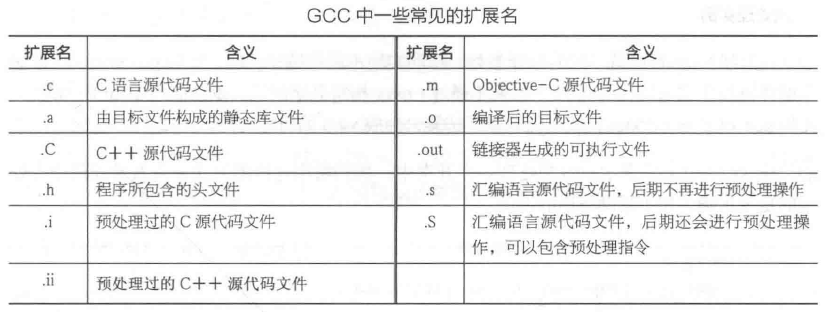
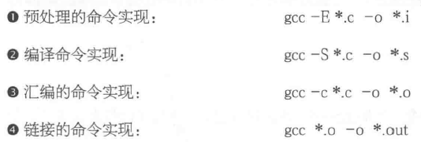

### C语言历史与特点

#### C语言的起源与发展

- 1963年，剑桥大学将ALGOL 60语言发展成为CPL(Combined Programming Language)语言。
- 1967年，剑桥大学的马丁·理查兹（Matin Richards）对CPL语言进行了简化，于是产生了BCPL语言。
- 1970年，美国贝尔实验室的肯·汤普森（Ken Thompson）将BCPL进行了修改，并为它起了一个有趣的名字——“B语言”，其含义是将CPL语言煮干，提炼出它的精华，同时他用B语言写了第一个UNIX操作系统。
- 1973年，美国贝尔实验室的丹尼斯·里奇（Dennis M.Ritchie）在B语言的基础上设计出了一种新的语言，他取了BCPL的第二个字母作为这种语言的名字，即C语言

美国国家标准学会（ANSI）为C语言制定了一套ANSI标准，即C语言标准。

- 在1989年美国国家标准学会(ANSI）通过的C语言标准ANSI X3.159-1989，被称为C89 。
- 在1990年，国际标准化组织ISO批准了ANSI C成为国际标准，于是ISO C诞生了，该标准被称为C90。
- 在1994年、1996年分别出版了C90的技术勘误文档，更正了一些印刷错误，ISO于并在1995年通过了一份C90的技术补充，对C90进行了微小的扩充，经扩充后的ISO C被成为C95 。
- 1999年，ANSI和ISO又通过了C99标准。

### C语言的特点

- C语言简洁、紧凑，使用方便、灵活，具有丰富的运算符和数据结构。
- C语言既具有高级语言的功能，又具有低级语言的许多功能。
- C语言是理想的结构化程序设计语言，符合现代编程风格的要求。
- C语言语法限制不太严格，程序设计自由度大。
- C语言编写的程序可移植性好（与汇编语言相比）。
- C语言生成目标代码质量高，程序执行效率高。

### C语言应用领域

C语言的应用极其广泛，从网站后台，到底层操作系统，从多媒体应用到大型网络游戏，均可使用C语言来开发：

- C语言可以写网站后台程序
- C语言可以专门针对某个主题写出功能强大的程序库
- C语言可以写出大型游戏的引擎
- C语言可以写出另一个语言来
- C语言可以写操作系统和驱动程序，并且只能用C语言编写
- 任何设备只要配置了微处理器，就都支持C语言。从微波炉到手机，都是由C语言技术来推动的


### C语言的简洁

C语言仅有32个关键字，9种控制语句，34种运算符，却能完成无数的功能


### C语言标准

- ANSI/ISO C 标准，通常叫 C89 或 C90 标准，ANSI 美国国家标准协会
- C99 标准
- C11 标准

### 通过gcc编译C代码

#### gcc编译器介绍

编辑器(如vi、记事本)是指我用它来写程序的（编辑代码），而我们写的代码语句，电脑是不懂的，我们需要把它转成电脑能懂的语句，编译器就是这样的转化工具。就是说，我们用编辑器编写程序，由编译器编译后才可以运行！

编译器是将易于编写、阅读和维护的高级计算机语言翻译为计算机能解读、运行的低级机器语言的程序。

gcc（GNU Compiler Collection，GNU 编译器套件），是由 GNU 开发的编程语言编译器。gcc原本作为GNU操作系统的官方编译器，现已被大多数类Unix操作系统（如Linux、BSD、Mac OS X等）采纳为标准的编译器，gcc同样适用于微软的Windows。

gcc最初用于编译C语言，随着项目的发展gcc已经成为了能够编译C、C++、Java、Ada、fortran、Object C、Object C++、Go语言的编译器大家族。

#### 编译命令格式
```
gcc [-option1] ... <filename>
g++ [-option1] ... <filename>
```

- 命令、选项和源文件之间使用空格分隔
- 一行命令中可以有零个、一个或多个选项
- 文件名可以包含文件的绝对路径，也可以使用相对路径
- 如果命令中不包含输出可执行文件的文件名，可执行文件的文件名会自动生成一个默认名，Linux平台为a.out，Windows平台为a.exe

#### gcc、g++编译常用选项说明

| 选项      | 含义              |
| ------- | --------------- |
| -o file | 指定生成的输出文件名为file |
| -E      | 只进行预处理          |
| -S(大写)  | 只进行预处理和编译       |
| -c(小写)  | 只进行预处理、编译和汇编    |

#### Linux平台下编译代码


- gcc warning的意思是警告，是有问题，但不影响编译
- error是错误，如果遇到error，那么就不能编译了

### 注意事项

Linux编译后的可执行程序只能在Linux运行，Windows编译后的程序只能在Windows下运行。

64位的Linux编译后的程序只能在64位Linux下运行，32位Linux编译后的程序只能在32位的Linux运行。

64位的Windows编译后的程序只能在64位Windows下运行，32位Windows编译后的程序可以在64位的Windows运行。

### C语言编译过程

#### C程序编译步骤

C代码编译成可执行程序经过4步：

1）预处理：宏定义展开、头文件展开、条件编译等，同时将代码中的注释删除，这里并不会检查语法
2）编译：检查语法，将预处理后文件编译生成汇编文件
3）汇编：将汇编文件生成目标文件(二进制文件)
4）链接：C语言写的程序是需要依赖各种库的，所以编译之后还需要把库链接到最终的可执行程序中去


#### gcc编译过程

分步编译

```
预处理：gcc -E hello.c -o hello.i
编  译：gcc -S hello.i -o hello.s
汇  编：gcc -c hello.s -o hello.o
链  接：gcc    hello.o -o hello_elf
```

| 选项      | 含义               |
| ------- | ---------------- |
| -E      | 只进行预处理           |
| -S(大写)  | 只进行预处理和编译        |
| -c(小写)  | 只进行预处理、编译和汇编     |
| -o file | 指定生成的输出文件名为 file |

| 文件后缀 | 含义           |
| ---- | ------------ |
| .c   | C 语言文件       |
| .i   | 预处理后的 C 语言文件 |
| .s   | 编译后的汇编文件     |
| .o   | 编译后的目标文件     |




一步编译

```bash
# 还是经过：预处理、编译、汇编、链接的过程
gcc hello.c -o demo
```


#### 使用GCC进行编译和链接的过程



#### 查找程序所依赖的动态库

1）Linux平台下，ldd(“l”为字母) 可执行程序


2）Windows平台下，需要相应软件(Depends.exe)


### C/C++与Java的区别

- C/C++可以在栈上分配内存
- 内存管理的不同：Java语言是自动管理内存，C/C++堆区申请的内存需要手动管理（malloc/free，new/delete）
- C/C++有指针，Java没有；C++有引用，C语言没有
- C++可以重载运算符，C和Java不可以
- C语言是面向过程的编程语言，C++和Java是面向对象的编程语言
- C/C++语言偏底层，偏硬件，Java偏上层。要想熟悉整个架构，必须熟悉C/C++和Java等语言。
- C语言存在很多“灰色地带”，C编译器的语法检查没有C++那么严格
- C语言中的const是个冒牌货，可以通过指针修改const修饰的变量
- C语言的目标是高效，最终程序执行效率的高效
- C/C++中用回调函数（函数指针）实现类似Java中的接口回调的功能
- C/C++通过汇编实现反射机制较难（提供了友元），Java因为.java文件会编译成.class字节码文件，可以较容易的实现反射机制（AOP）

### 入门书籍

#### C语言开发入门教程

- 视频链接：https://pan.baidu.com/s/1c1Yjr80 密码: idtn
- 答案链接：http://pan.baidu.com/s/1hsbk2tm 密码：g81c
- 源码链接：http://pan.baidu.com/s/1jHL7up4 密码：hafs
- 题库链接：http://pan.baidu.com/s/1c17604g 密码：vqfw
- 方案链接：http://pan.baidu.com/s/1hsbk2tm 密码：g81c

#### C语言程序设计教程

- 视频链接：http://pan.baidu.com/s/1kVmaT0r 密码：twv7
- 答案链接：http://pan.baidu.com/s/1kUMmNrh 密码：5jso
- 源码链接：http://pan.baidu.com/s/1kVCsf9X 密码：weo8
- 题库链接：http://pan.baidu.com/s/1c17604g 密码：vqfw
- 方案链接：http://pan.baidu.com/s/1hrXgG8s 密码：1flr

#### C++程序设计教程

- 视频链接：http://pan.baidu.com/s/1o78Fkh0 密码：ourc
- 题库链接：http://pan.baidu.com/s/1qYVKIyo 密码：xkgz
- 答案链接：http://pan.baidu.com/s/1pLhbNmV 密码：vnrr
- 源码链接：http://pan.baidu.com/s/1i4VINrR 密码：dbec
- 方案链接：http://pan.baidu.com/s/1dFFSjmx 密码：8fqh

### 经典书籍

- c primer plus 第6版
- C语言深度解剖 解开程序员面试笔记的秘密
- 嵌入式Linux与物联网软件开发 C语言内核深度解析
- C语言接口与实现
- C和指针
- C陷阱与缺陷
- C专家编程