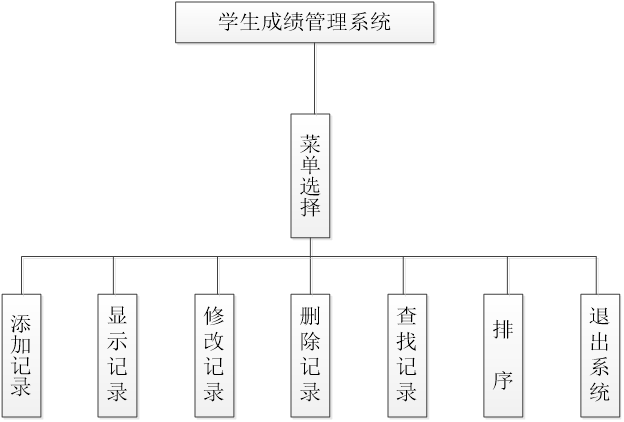

## 学生成绩管理系统

### 案例描述

 案例要求模拟开发一个学生成绩管理系统，此系统具有以下功能：

（1）添加学生信息，包括学号、姓名、语文、数学成绩；
（2）显示学生信息，将所有学生信息打印输出；
（3）修改学生信息，可以根据姓名查找到学生，然后可以修改学生姓名、成绩项；
（4）删除学生信息，根据学号查找到学生，将其信息删除；
（5）查找学生信息，根据学生姓名，将其信息打印输出；
（6）按学生总成绩进行从高到低排序。

请通过编程完成此系统的开发。

### 案例分析

因为学生信息包括学号、姓名和成绩等不同数据类型的属性，所以需要定义一个学生类型的结构体。
在存储学生信息时，可选用数组或链表，考虑到学生要根据总成绩来排序，为方便排序，我们选用数组来存储学生信息。

### 案例实现

功能模块



功能函数实现

- 添加记录—add()函数；
- 显示记录—showAll()函数；
- 修改记录—modify()函数；
- 删除记录—del()函数；
- 查找记录—search()函数；
- 排序—sort()函数。

### 案例代码

#### Student.h

```c
#ifndef STUDENT         //先测试STUDENT是否被宏定义过，避免重新使用
#define STUDENT         //定义STUDENT
#include <stdio.h>
#include <string.h>
#include <stdlib.h>
#define HH printf("%-10s%-10s%-10s%-10s%-10s\n",
"学号", "姓名", "语文成绩", "数学成绩", "总分")
struct student          //学生记录
{
	int   	id;         //学号
	char	name[8];   //姓名
	int  	chinese;   //语文成绩
	int		math;	   //数学成绩
	int  	sum;	   //总分
};
static int n;  		   //记录学生信息条数
void menu();
void add(struct student stu[]);              //函数声明
void show(struct student stu[], int i);
void showAll(struct student stu[]);
void modify(struct student stu[]);
void del(struct student stu[]);
void search(struct student stu[]);
void sort(struct student stu[]);            //函数声明
#endif                //结束条件编译
```

#### Student.c

```c
#define _CRT_SECURE_NO_WARNINGS
#include "Student.h"
void menu()
{
	system("cls");//清空屏幕
	printf("\n");
	printf("\t\t --------------学生成绩管理系统--------------\n");
	printf("\t\t︱\t\t 1 添加记录                 ︱\n");
	printf("\t\t︱\t\t 2 显示记录                 ︱\n");
	printf("\t\t︱\t\t 3 修改记录                 ︱\n");
	printf("\t\t︱\t\t 4 删除记录                 ︱\n");
	printf("\t\t︱\t\t 5 查找记录                 ︱\n");
	printf("\t\t︱\t\t 6 排序记录                 ︱\n");
	printf("\t\t︱\t\t 0 退出系统                 ︱\n");
	printf("\t\t --------------------------------------------\n");
	printf("\t\t请选择(0-6):");
}

void add(struct student stu[])
{
	int i, id = 0; //i作为循环变量，id用来保存新学号
	char quit;  //保存是否退出的选择
	do
	{
		printf("学号：");
		scanf("%d", &id);
		for (i = 0; i < n; i++)
		{
			if (id == stu[i].id)  //假如新学号等于数组中某生的学号
			{
				printf("此学号存在！\n");
				return;
			}
		}
		stu[i].id = id;
		printf("姓名：");
		scanf("%s", &stu[i].name);
		printf("语文成绩：");
		scanf("%d", &stu[i].chinese);
		printf("数学成绩：");
		scanf("%d", &stu[i].math);
		stu[i].sum = stu[i].chinese + stu[i].math;  //计算出总成绩
		n++;  //记录条数加1
		printf("是否继续添加?(Y/N)");
		scanf("\t%c", &quit);
	} while (quit != 'N');
}

void show(struct student stu[], int i)
{
	printf("%-10d", stu[i].id);
	printf("%-10s", stu[i].name);
	printf("%-10d", stu[i].chinese);
	printf("%-10d", stu[i].math);
	printf("%-10d\n", stu[i].sum);
}

void showAll(struct student stu[])
{
	int i;
	HH;
	for (i = 0; i < n; i++)
	{
		show(stu, i);
	}
}

void modify(struct student stu[])
{
	char name[8], ch;                 //name用来保存姓名，ch用来保存是否退出的选择
	int i;
	printf("修改学生的记录。\n");
	printf("请输入学生的姓名：");
	scanf("%s", &name);
	for (i = 0; i < n; i++)
	{
		if (strcmp(name, stu[i].name) == 0)
		{
			getchar();    	          //提取并丢掉回车键
			printf("找到该生的记录，如下所示：\n");
			HH;             	          //显示记录的标题
			show(stu, i);  	          //显示数组stu中的第i条记录
			printf("是否修改?(Y/N)\n");
			scanf("%c", &ch);
			if (ch == 'Y' || ch == 'y')
			{
				getchar();   //提取并丢掉回车键
				printf("姓名：");
				scanf("%s", &stu[i].name);
				printf("语文成绩：");
				scanf("%d", &stu[i].chinese);
				printf("数学成绩：");
				scanf("%d", &stu[i].math);
				stu[i].sum = stu[i].chinese + stu[i].math;  //计算出总成绩
				printf("修改完毕。\n");
			}
			return;
		}
	}
	printf("没有找到该生的记录。\n");
}

void del(struct student stu[])
{
	int id, i;
	char ch;
	printf("删除学生的记录。\n");
	printf("请输入学号：");
	scanf("%d", &id);
	for (i = 0; i < n; i++)
	{
		if (id == stu[i].id)
		{
			getchar();
			printf("找到该生的记录，如下所示：\n");
			HH;                			    //显示记录的标题
			show(stu, i);     			    //显示数组stu中的第i条记录
			printf("是否删除?(Y/N)\n");
			scanf("%c", &ch);
			if (ch == 'Y' || ch == 'y')
			{
				for (; i < n; i++)
					stu[i] = stu[i + 1];	//被删除记录后面的记录均前移一位
				n--;          				//记录总条数减1
				printf("删除成功！");
			}
			return;
		}
	}
	printf("没有找到该生的记录！\n");
}

void search(struct student stu[])
{
	char name[8];
	int i;
	printf("查找学生的记录。\n");
	printf("请输入学生的姓名：");
	scanf("%s", &name);
	for (i = 0; i < n; i++)
	{
		if (strcmp(name, stu[i].name) == 0)
		{
			printf("找到该生的记录，如下所示：\n");
			HH;            //显示记录的标题
			show(stu, i); //显示数组stu中的第i条记录
			return;
		}
	}
	printf("没有找到该生的记录。\n");
}

void sort(struct student stu[])
{
	int i, j;
	struct student t;
	printf("按总成绩进行排序，");
	for (i = 0; i < n - 1; i++)           //双层循环实现总分的比较与排序
	{
		for (j = i + 1; j < n; j++)
		{
			if (stu[i].sum < stu[j].sum)
			{
				t = stu[i];
				stu[i] = stu[j];
				stu[j] = t;
			}
		}
	}
	printf("排序结果如下：\n");
	showAll(stu);                  		//显示排序后的所有记录
}
```

#### main.c

```c
#include <stdio.h>
#include "student.h"    //包含子函数原型文件student.h

int main()
{
	struct student stu[50];     //用来保存学生记录，最多保存50条
	int select, quit = 0;
	while (1)
	{
		menu();			   		//调用子函数Menu输出菜单选项
		scanf("%d", &select);	//将用户输入的选择保存到select
		switch (select)
		{
		case 1:              	     //用户选择1，即添加记录，会转到这里来执行
			add(stu);        	//调用子函数In，同时传递数组名stu
			break;
		case 2: 			  	//用户选择2，即显示记录，会转到这里来执行
			showAll(stu); 		//调用子函数ShowAll，同时传递数组名stu
			break;
		case 3: 			  	//用户选择3，即修改记录，会转到这里来执行
			modify(stu);  		//调用子函数Modify，同时传递数组名stu
			break;
		case 4: 			  	//用户选择4，即删除记录，会转到这里来执行
			del(stu); 	  		//调用子函数Del，同时传递数组名stu
			break;
		case 5: 			  	//用户选择5，即查找记录，会转到这里来执行
			search(stu);  		//调用子函数Search，同时传递数组名stu
			break;
		case 6: 			  	//用户选择6，即排序记录，会转到这里来执行
			sort(stu); 	  		//调用子函数Sort，同时传递数组名stu
			break;
		case 0:             	     //用户选择0，即退出系统，会转到这里来执行
			quit = 1;        	//将quit的值修改为1，表示可以退出死循环了
			break;
		default:
			printf("请输入0-6之间的数字\n");
			break;
		}
		if (quit == 1)
			break;
		printf("按任意键返回主菜单！\n");
		getchar();  //提取缓冲区中的回车键
		getchar();  //起到暂停的作用
	}
	printf("程序结束！\n");
	return 0;
}
```