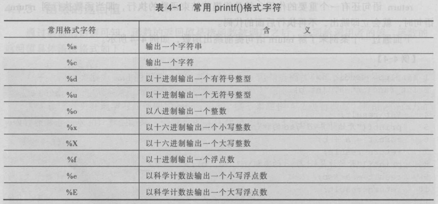
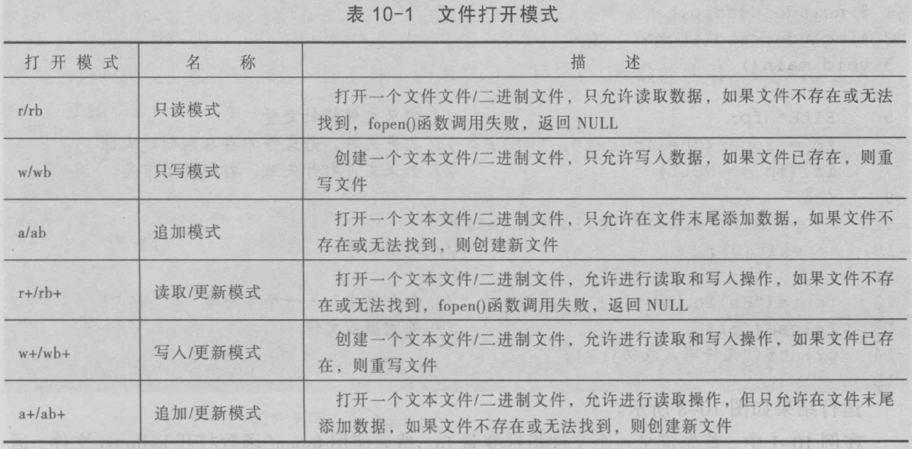

### 计算机中的流

- 文本流
- 二进制流
- 预定义的流
  - stdin 标准输入流
  - stdout 标准输出流
  - stderr 标准错误输出流

### 文件

文件标识：文件路径，文件名主干，文件扩展名

文件的分类

- 二进制文件（映像文件）
- 文本文件（ASCII文件）

### 文件缓冲区

减少磁盘的读写次数，延长磁盘的使用寿命；提高计算机的运行速度

### 文件指针

```
FILE *fp;
```

| 函数声明       | 功能描述                      |
| ---------- | ------------------------- |
| fopen()    | 打开文件                      |
| fclose()   | 关闭文件                      |
| fgetc()    | 读取一个字符                    |
| fputc()    | 写入一个字符                    |
| fgets()    | 读取一个字符串                   |
| fputs()    | 写入一个字符串                   |
| fwrite()   | 写入数据                      |
| fread()    | 读取数据                      |
| printf()   | 格式化输出到控制台                 |
| scanf()    | 从标准输入设备（键盘）接收用户的输入（格式化输入） |
| fprintf()  | 格式化输出数据到文件                |
| fscanf()   | 从文件中格式化读取数据               |
| feof()     | 判断文件是否处于文件结束位置            |
| ferror()   | 检查文件在读写操作时是否出错            |
| clearerr() | 清除出错标志和文件结束标志             |

### 常用printf()格式字符



### scanf()输入字符串的终止符


### 文件打开模式



### 文件的随机读写

| 函数声明     | 功能描述         |
| -------- | ------------ |
| rewind() | 将文件指针指向文件开头  |
| fseek()  | 将文件指针移动到指定位置 |
| ftell()  | 获取文件指针的当前位置  |
|          |              |