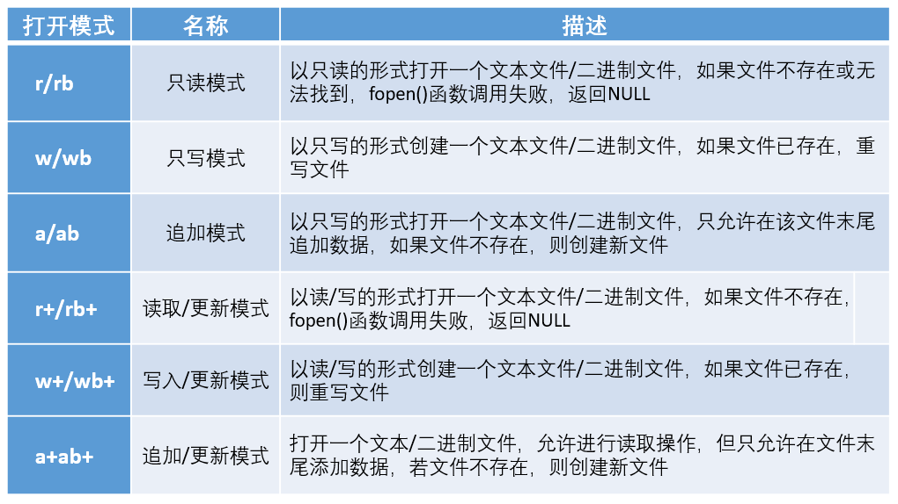

“文件”是指一组相关数据的有序集合。这个数据集有一个名称，叫做文件名。通常情况下，使用计算机也就是在使用文件。


### 文件指针

文件指针是一个指向文件有关信息的指针，这些信息包括文件名、状态和当前位置，它们保存在一个结构体变量中。在使用文件时需要在内存中为其分配空间，用来存放文件的基本信息。该结构体类型是由系统定义的，C语言规定该类型为FILE型。

### 计算机中的流

- 文本流
- 二进制流
- 预定义的流
  - stdin 标准输入流
  - stdout 标准输出流
  - stderr 标准错误输出流

### 文件

文件标识：文件路径，文件名主干，文件扩展名

文件的分类

- 二进制文件（映像文件）
- 文本文件（ASCII文件）

### 文件缓冲区

减少磁盘的读写次数，延长磁盘的使用寿命；提高计算机的运行速度

### 文件指针

```
FILE *fp;
```

| 函数声明       | 功能描述                      |
| ---------- | ------------------------- |
| fopen()    | 打开文件                      |
| fclose()   | 关闭文件                      |
| fgetc()    | 读取一个字符                    |
| fputc()    | 写入一个字符                    |
| fgets()    | 读取一个字符串                   |
| fputs()    | 写入一个字符串                   |
| fwrite()   | 写入数据                      |
| fread()    | 读取数据                      |
| printf()   | 格式化输出到控制台                 |
| scanf()    | 从标准输入设备（键盘）接收用户的输入（格式化输入） |
| fprintf()  | 格式化输出数据到文件                |
| fscanf()   | 从文件中格式化读取数据               |
| feof()     | 判断文件是否处于文件结束位置            |
| ferror()   | 检查文件在读写操作时是否出错            |
| clearerr() | 清除出错标志和文件结束标志             |
| getchar()  | 从标准输入设备中读取一个字符            |
| putchar()  | 把一个字符输出到标准输出设备            |
| puts()     | 把一个字符串输出到标准输出设备，并追加换行符    |
| gets()     | 从标准输入设备读取一个字符串            |

### 常用printf()格式字符


### scanf()输入字符串的终止符


### 文件打开模式

| 文件使用方式  | 含    义                  |
| ------- | ----------------------- |
| r（只读）   | 打开一个文本文件，只允许读数据         |
| w（只写）   | 打开或建立一个文本文件，只允许写数据      |
| a（追加）   | 打开一个文本文件，并在文件末尾写数据      |
| rb（只读）  | 打开一个二进制文件，只允许读数据        |
| wb（只写）  | 打开或建立一个二进制文件，只允许写数据     |
| ab（追加）  | 打开一个二进制文件，并在文件末尾写数据     |
| r+（读写）  | 打开一个文本文件，允许读和写          |
| w+（读写）  | 打开或建立一个文本文件，允许读写        |
| a+（读写）  | 打开一个文本文件，允许读，或在文件末追加数据  |
| rb+（读写） | 打开一个二进制文件，允许读和写         |
| wb+（读写） | 打开或建立一个二进制文件，允许读和写      |
| ab+（读写） | 打开一个二进制文件，允许读，或在文件末追加数据 |

| 打开模式   | 名称      | 描述                                       |
| ------ | ------- | ---------------------------------------- |
| r/rb   | 只读模式    | 以只读的形式打开一个文本文件/二进制文件，如果文件不存在或无法找到，fopen()函数调用失败，返回NULL |
| w/wb   | 只写模式    | 以只写的形式创建一个文本文件/二进制文件，如果文件已存在，重写文件        |
| a/ab   | 追加模式    | 以只写的形式打开一个文本文件/二进制文件，只允许在该文件末尾追加数据，如果文件不存在，则创建新文件 |
| r+/rb+ | 读取/更新模式 | 以读/写的形式打开一个文本文件/二进制文件，如果文件不存在，fopen()函数调用失败，返回NULL |
| w+/wb+ | 写入/更新模式 | 以读/写的形式创建一个文本文件/二进制文件，如果文件已存在，则重写文件      |
| a+ab+  | 追加/更新模式 | 打开一个文本/二进制文件，允许进行读取操作，但只允许在文件末尾添加数据，若文件不存在，则创建新文件 |




### 文件的随机读写

| 函数声明     | 功能描述         |
| -------- | ------------ |
| rewind() | 将文件指针指向文件开头  |
| fseek()  | 将文件指针移动到指定位置 |
| ftell()  | 获取文件指针的当前位置  |