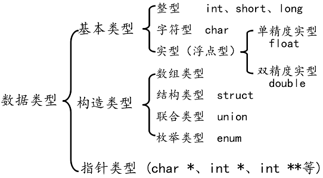
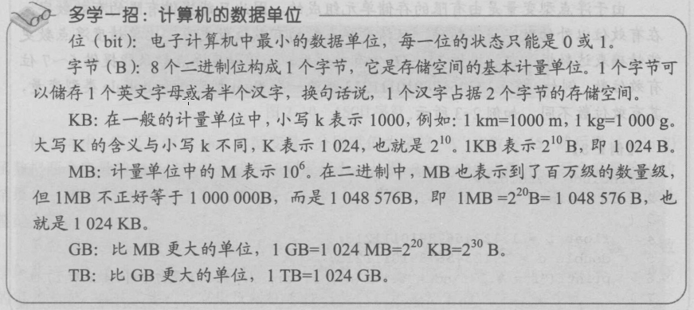

### 数据类型和运算符

- 数据存储的原理
  - 进制：十进制，二进制，八进制，十六进制
  - 进制转换
  - 源码、反码、补码
  - 源码、反码、补码的应用
- 关键字和标识符
- 常量和变量
- 运算符

### 补码

正数：原码 = 反码 = 补码，负数：反码 = 原码取反，补码 = 原码取反加1

负数以补码的形式在计算机中存储

```c
#include<stdio.h>
#include<stdlib.h>

void main3()
{
	//printf不会进行数据类型转换
	printf("%d", (int)10.3);//printf不管你是什么类型，按照%d ,%f解析数据
	printf("\n%f", (float)10);
	getchar();
}

void  main4()
{
	int num = 100;
	printf("%p", &num);//不同的解释方式就有不同的解释结果

	getchar();
}

void   main5()
{
	char ch = 1,ch1='1';//字符与编号的区别
	printf("%d,%d", ch,ch1);

	getchar();
}

void   main6()
{
	//解析的时候，与数据的长度有关系
	unsigned short num = 65535+1;
	printf("刘宁波有%d元", num);
	//  99
	// 100
	getchar();
}

void   main7()
{
	//补码，计算机存储数据的方式
	short num = -1;
	printf("%d", num);
	printf("\n%u", num);//%u 0-正整数

	getchar();
}
```

### 计算机补码原理

```c
#include<stdio.h>
#include<stdlib.h>
#include<limits.h>

void main10()
{
	int x = 1;
	int y = -1;//补码

	printf("x=%p,y=%p", &x, &y);
  
	system("pause");
}

void  main123()
{
	//int  unsigned int  4个字节32位
	//有符号，0代表正数，1代表负数

	//0111 1111 1111 1111 1111 1111 1111 1111
	//1111 1111 1111 1111 1111 1111 1111 1111//无符号，正数，全部都是数据

	printf("%d,%d", INT_MAX, INT_MIN);//%d只能显示INT_MIN->INT_MAX
	printf("\n%d,%d", INT_MAX+1, INT_MIN-1);
	printf("\n%u,%u", UINT_MAX, 0);
	printf("\n%u,%u", UINT_MAX+1, 0-1);//%u   0->UINT_MAX

	system("pause");
}

void main1234()
{
	int x = 4294967295;
	int y = -1;
	//1111 1111 1111 1111 1111 1111 1111 1111内存的存储方式
	//无符号，没有符号位，全部都是数据 4294967295

	//0000 0000 0000 0000  0000 0000 0000 0001 1原码
	//1000 0000 0000 0000  0000 0000 0000 0001 -1的原码
	//1111 1111 1111 1111  1111 1111 1111 1110 -1的反码
	//1111 1111 1111 1111  1111 1111 1111 1111 -1的补码
	
	printf("%d，%u", x,x);
	printf("\n%d,%u", y, y);
	getchar();
}

void  main()
{
	unsigned int num = -1;
	//1111 1111 1111 1111 1111 1111 1111 1111内存的存储方式
	printf("%d,%u", num, num);

	system("pause");
}
```

### 常量与变量

关键字


### 数据类型

数据类型的作用：编译器预算对象（变量）分配的内存空间大小。



数据类型的本质是固定内存大小的别名

数据类型决定了变量占用的空间大小和内存的解析方法

类型对于编译器来说，主要就是用于说明数据存储空间的大小以及数据的存储结构

数据类型的作用是：编译器预算对象（变量）分配的内存空间大小

求数据类型的大小：sizeof(int *)

数据类型可以有别名吗？数据类型可以自定义吗？typedef

```c
void main31()
{
	int a; //告诉c编译器分配4个字节的内存
	int b[10] ; //告诉c编译器分配40个自己内存

	printf("b:%d, b+1:%d, &b:%d, &b+1:%d \n", b, b+1, &b, &b+1);

	printf("sizeof(b):%d \n", sizeof(b));  //40
	printf("sizeof(a):%d \n ", sizeof(a)); //4
 	//b 代表的数组首元素的地址
	//&b代表的是整个数组的地址  
  	system("pause");
}
```

### 静态存储区的理解

```c
#define  _CRT_SECURE_NO_WARNINGS 
#include <stdlib.h>
#include <string.h>
#include <stdio.h>

char * getStr1()
{
	char *p1 = "abcdefg2";
	return p1;
}
char *getStr2()
{
	char *p2 = "abcdefg2";
	return p2;
}

void main()
{
	char *p1 = NULL;
	char *p2 = NULL;
	p1 = getStr1();
	p2 = getStr2();

	//打印p1 p2 所指向内存空间的数据
	printf("p1:%s , p2:%s \n", p1, p2);

	//打印p1 p2 的值
	printf("p1:%d , p2:%d \n", p1, p2);
  
	system("pause");
	return ;
}
```

运行结果

```
p1:abcdefg2 , p2:abcdefg
p1:4210688 , p2:4210688
```

### 字符型：char

#### 字符变量的定义和输出

字符型变量用于存储一个单一字符，在 C 语言中用 char 表示，其中每个字符变量都会占用 1 个字节。在给字符型变量赋值时，需要用一对英文半角格式的单引号(' ')把字符括起来。

字符变量实际上并不是把该字符本身放到变量的内存单元中去，而是将该字符对应的 ASCII 编码放到变量的存储单元中。char的本质就是一个1字节大小的整型。

#### ASCII对照表

| ASCII值 | 控制字符 | ASCII值 | 字符      | ASCII值 | 字符   | ASCII值 | 字符   |
| ------ | ---- | ------ | ------- | ------ | ---- | ------ | ---- |
| 0      | NUT  | 32     | (space) | 64     | @    | 96     | 、    |
| 1      | SOH  | 33     | !       | 65     | A    | 97     | a    |
| 2      | STX  | 34     | "       | 66     | B    | 98     | b    |
| 3      | ETX  | 35     | #       | 67     | C    | 99     | c    |
| 4      | EOT  | 36     | $       | 68     | D    | 100    | d    |
| 5      | ENQ  | 37     | %       | 69     | E    | 101    | e    |
| 6      | ACK  | 38     | &       | 70     | F    | 102    | f    |
| 7      | BEL  | 39     | ,       | 71     | G    | 103    | g    |
| 8      | BS   | 40     | (       | 72     | H    | 104    | h    |
| 9      | HT   | 41     | )       | 73     | I    | 105    | i    |
| 10     | LF   | 42     | *       | 74     | J    | 106    | j    |
| 11     | VT   | 43     | +       | 75     | K    | 107    | k    |
| 12     | FF   | 44     | ,       | 76     | L    | 108    | l    |
| 13     | CR   | 45     | -       | 77     | M    | 109    | m    |
| 14     | SO   | 46     | .       | 78     | N    | 110    | n    |
| 15     | SI   | 47     | /       | 79     | O    | 111    | o    |
| 16     | DLE  | 48     | 0       | 80     | P    | 112    | p    |
| 17     | DCI  | 49     | 1       | 81     | Q    | 113    | q    |
| 18     | DC2  | 50     | 2       | 82     | R    | 114    | r    |
| 19     | DC3  | 51     | 3       | 83     | S    | 115    | s    |
| 20     | DC4  | 52     | 4       | 84     | T    | 116    | t    |
| 21     | NAK  | 53     | 5       | 85     | U    | 117    | u    |
| 22     | SYN  | 54     | 6       | 86     | V    | 118    | v    |
| 23     | TB   | 55     | 7       | 87     | W    | 119    | w    |
| 24     | CAN  | 56     | 8       | 88     | X    | 120    | x    |
| 25     | EM   | 57     | 9       | 89     | Y    | 121    | y    |
| 26     | SUB  | 58     | :       | 90     | Z    | 122    | z    |
| 27     | ESC  | 59     | ;       | 91     | [    | 123    | {    |
| 28     | FS   | 60     | <       | 92     | /    | 124    | \|   |
| 29     | GS   | 61     | =       | 93     | ]    | 125    | }    |
| 30     | RS   | 62     | >       | 94     | ^    | 126    | `    |
| 31     | US   | 63     | ?       | 95     | _    | 127    | DEL  |

ASCII 码大致由以下两部分组成：

- ASCII 非打印控制字符： ASCII 表上的数字 0-31 分配给了控制字符，用于控制像打印机等一些外围设备。
- ASCII 打印字符：数字 32-126 分配给了能在键盘上找到的字符，当查看或打印文档时就会出现。数字 127 代表 Del 命令。

#### 转义字符

| 转义字符 | 含义                      | ASCII码值（十进制） |
| ---- | ----------------------- | ------------ |
| \a   | 警报                      | 007          |
| \b   | 退格(BS) ，将当前位置移到前一列      | 008          |
| \f   | 换页(FF)，将当前位置移到下页开头      | 012          |
| \n   | 换行(LF) ，将当前位置移到下一行开头    | 010          |
| \r   | 回车(CR) ，将当前位置移到本行开头     | 013          |
| \t   | 水平制表(HT)  （跳到下一个TAB位置）  | 009          |
| \v   | 垂直制表(VT)                | 011          |
| \\\\ | 代表一个反斜线字符"\"            | 092          |
| \'   | 代表一个单引号（撇号）字符           | 039          |
| \"   | 代表一个双引号字符               | 034          |
| \?   | 代表一个问号                  | 063          |
| \0   | 数字0                     | 000          |
| \ddd | 8进制转义字符，d范围0~7          | 3位8进制        |
| \xhh | 16进制转义字符，h范围0~9，a~f，A~F | 3位16进制       |

### 类型限定符

| 限定符      | 含义                                       |
| -------- | ---------------------------------------- |
| extern   | 声明一个变量，extern声明的变量没有建立存储空间。  extern int a; |
| const    | 定义一个常量，常量的值不能修改。  const int a = 10;      |
| volatile | 防止编译器优化代码                                |
| register | 定义寄存器变量，提高效率。register是建议型的指令，而不是命令型的指令，如果CPU有空闲寄存器，那么register就生效，如果没有空闲寄存器，那么register无效。 |

### 数据类型别名

数据类型可以理解为固定大小内存块的别名，可以使用typedef关键字给已存在的数据类型起别名

```c
struct Teacher
{
	char name[64];
	int age;
}Teacher;

typedef struct Teacher2
{
	char name[64];
	int age;
}Teacher2;
//数据别名 typedef

typedef int u32;

void main33()
{
	int a; //告诉c编译器分配4个字节的内存
	int b[10] ; //告诉c编译器分配40个字节内存

	struct Teacher t1;

	Teacher2 t2;
	t1.age = 31;

	printf("u32:%d \n", sizeof(u32));

	{
		char *p2 = NULL;
		void *p1 = NULL;
		p2 = (char *)malloc(100);
		p1 = &p2;
	}
	{
		//void a;//编译器不知道如何分配内存
	}

	printf("hello....\n");
	system("pause");
}
```

### 强制类型转换


数据有不同的类型，不同类型数据之间进行混合运算时必然涉及到类型的转换问题。


转换的方法有两种：

- 自动转换(隐式转换)：遵循一定的规则,由编译系统自动完成。
- 强制类型转换：把表达式的运算结果强制转换成所需的数据类型。

类型转换的原则：占用内存字节数少(值域小)的类型，向占用内存字节数多(值域大)的类型转换，以保证精度不降低。


```c
float a = 12.34;
int b = (int)a;
```

- 创建临时变量X（int类型）
- 将 float a 的整数部分赋值给X
- 将 X 赋值给b
- 销毁 X


### 变量数据类型的作用

- 程序员写代码时识别用：知道变量中应该存放什么类型的数值
- 给编译器看的：说明数值在存储时需要的内存空间字节数；说明存储结构

### 普通变量数据类型转换的本质

将数据的空间大小和数据的存储结构转变后，存入另一个变量空间

数据类型转换会导致数据存储空间大小和存储结构的变化

### 变量的本质

变量三要素：名称、大小、作用域

既能读又能写的内存对象，称为变量；若一旦初始化后不能修改的对象则称为常量。

程序通过变量来申请和命名内存空间 int a = 0

通过变量名访问内存空间，变量是（一段连续）内存空间的别名（是一个门牌号）

修改变量：直接修改；间接修改，内存有地址编号，拿到地址编号也可以修改内存

总结：

- 对内存，可读可写
- 通过变量往内存读写数据
- 不是向变量读写数据，而是向变量所代表的内存空间中写数据

```c
void main44()
{
	int a ;
	int b; 
	char *p ;
	//p = 0xaa11
	a = 10; //1 直接赋值  //cpu里面执行

	printf("&a: %d\n", &a);

	//2间接赋值 ==直接通过内存
	 *((int*)1245024) = 200;

	 printf("a: %d\n", a);

	 {
		p = 1245024;  // 间接赋值 通过指针
		*p = 300;
	 }

	 //3 对内存空间能不能在取别名
	//1245024
	
	printf("hello...\n");
	system("pause");
	return ;
}
```

### 程序的内存四区模型


流程说明

1. 操作系统把物理硬盘代码load到内存
2. 操作系统把c代码分成四个区
3. 操作系统找到main函数入口执行

各区元素分析


### void 类型

万能类型，在需要时再具体指定；在描述一段还没有具体使用的内存时需要使用void类型。

void * 类型的指针指向的内存是尚未确定类型的，因此我们后续可以使用强制类型转换，强行将其转为各种类型。这就是void类型的最终归宿——被强制类型转换成一个具体的类型。

void * 万能指针，void * 可以指向任何类型的数据，在32位系统下，占4个字节

```c
void* malloc(size_t size)
int *p = (int *)malloc(sizeof(int));
```
void类型的本质


#### void的作用

- 对函数参数的限定：当不需要传入参数时，即 `function (void);`
- 对函数返回值的限定：当函数没有返回值时，即 `void function(void);`

#### void指针的作用

（1）void指针可以指向任意的数据类型，即任意类型的指针可以赋值给void指针

```c
int *a;
void *p;
p=a;
```
如果void指针赋值给其他类型，则需要强制转换；`a=（int *）p;`

（2）在ANSI C标准中不允许对void指针进行算术运算，因为没有特定的数据类型，即在内存中不知道移动多少个字节；而在GNU标准中，认为void指针和char指针等同。

#### 应用

（1）void指针一般用于应用的底层，比如malloc函数的返回类型是void指针，需要再强制转换；
（2）文件句柄HANDLE也是void指针类型，这也是句柄和指针的区别；
（3）内存操作函数的原型也需要void指针限定传入参数：

```c
void * memcpy (void *dest, const void *src, size_t len);
void * memset (void *buffer, int c, size_t num );
```
（4）面向对象函数中底层对基类的抽象。

### 位操作

左移<<：左边移出去的二进制位丢弃，右边空出的二进制位补0，X << n = X * 2<sup>n</sup>

右移>>：左边的二进制位补0或者补1（如果操作数是无符号数或有符号正数就补0，如果是有符号负数就补1），右边的二进制位丢弃，X >> n = X / 2<sup>n</sup>

### 计算机中的数据单位



| 术语        | 含义                                       |
| --------- | ---------------------------------------- |
| bit(比特)   | 一个二进制代表一位，一个位只能表示0或1两种状态。数据传输是习惯以“位”（bit）为单位。 |
| Byte(字节)  | 一个字节为8个二进制，称为8位，计算机中存储的最小单位是字节。数据存储是习惯以“字节”（Byte）为单位。 |
| WORD(双字节) | 2个字节，16位                                 |
| DWORD     | 两个WORD，4个字节，32位                          |
| 1b        | 1bit，1位                                  |
| 1B        | 1Byte,1字节，8位                             |
| 1k，1K     | 1024                                     |
| 1M(1兆)    | 1024k, 1024*1024                         |
| 1G        | 1024M                                    |
| 1T        | 1024G                                    |
| 1Kb(千位)   | 1024bit,1024位                            |
| 1KB(千字节)  | 1024Byte，1024字节                          |
| 1Mb(兆位)   | 1024Kb = 1024 * 1024bit                  |
| 1MB(兆字节)  | 1024KB = 1024 * 1024Byte                 |

