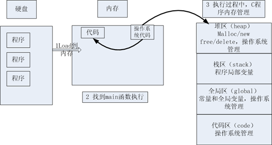

### 数据类型和运算符

- 数据存储的原理
  - 进制
  - 进制转换
  - 源码、反码、补码
  - 源码、反码、补码的应用
- 关键字和标识符
- 常量和变量
- 运算符

### 计算机中的数据单位


### 数据类型

数据类型的本质是固定内存大小的别名

数据类型决定了变量占用的空间大小和内存的解析方法

数据类型的作用是：编译器预算对象（变量）分配的内存空间大小

求数据类型的大小：sizeof(int *)

数据类型可以有别名吗？数据类型可以自定义吗？typedef

```c
void main31()
{
	int a; //告诉c编译器分配4个字节的内存
	int b[10] ; //告诉c编译器分配40个自己内存

	printf("b:%d, b+1:%d, &b:%d, &b+1:%d \n", b, b+1, &b, &b+1);

	printf("sizeof(b):%d \n", sizeof(b));  //40
	printf("sizeof(a):%d \n ", sizeof(a)); //4
 	//b 代表的数组首元素的地址
	//&b代表的是整个数组的地址  
  	system("pause");
}
```

### 数据类型别名

数据类型可以理解为固定大小内存块的别名，可以使用typedef关键字给已存在的数据类型起别名

```c
struct Teacher
{
	char name[64];
	int age;
}Teacher;

typedef struct Teacher2
{
	char name[64];
	int age;
}Teacher2;
//数据别名 typedef

typedef int u32;

void main33()
{
	int a; //告诉c编译器分配4个字节的内存
	int b[10] ; //告诉c编译器分配40个字节内存

	struct Teacher t1;

	Teacher2 t2;
	t1.age = 31;

	printf("u32:%d \n", sizeof(u32));

	{
		char *p2 = NULL;
		void *p1 = NULL;
		p2 = (char *)malloc(100);
		p1 = &p2;
	}
	{
		//void a;//编译器不知道如何分配内存
	}

	printf("hello....\n");
	system("pause");
}
```

### 强制类型转换

```
float a = 12.34;
int b = (int)a;
```

- 创建临时变量X（int类型）
- 将 float a 的整数部分赋值给X
- 将 X 赋值给b
- 销毁 X

### 变量数据类型的作用

- 程序员写代码时识别用：知道变量中应该存放什么类型的数值
- 给编译器看的：说明数值在存储时需要的内存空间字节数；说明存储结构

### 普通变量数据类型转换的本质

将数据的空间大小和数据的存储结构转变后，存入另一个变量空间

### 变量的本质

变量三要素：名称、大小、作用域

既能读又能写的内存对象，称为变量；若一旦初始化后不能修改的对象则称为常量。

程序通过变量来申请和命名内存空间 int a = 0

通过变量名访问内存空间，变量是（一段连续）内存空间的别名（是一个门牌号）

修改变量：直接修改；间接修改，内存有地址编号，拿到地址编号也可以修改内存

总结：

- 对内存，可读可写
- 通过变量往内存读写数据
- 不是向变量读写数据，而是向变量所代表的内存空间中写数据

```c
void main44()
{
	int a ;
	int b; 
	char *p ;
	//p = 0xaa11
	a = 10; //1 直接赋值  //cpu里面执行

	printf("&a: %d\n", &a);

	//2间接赋值 ==直接通过内存
	 *((int*)1245024) = 200;

	 printf("a: %d\n", a);

	 {
		p = 1245024;  // 间接赋值 通过指针
		*p = 300;
	 }

	 //3 对内存空间能不能在取别名
	//1245024
	
	printf("hello...\n");
	system("pause");
	return ;
}
```

### 程序的内存四区模型



流程说明

1. 操作系统把物理硬盘代码load到内存
2. 操作系统把c代码分成四个区
3. 操作系统找到main函数入口执行

各区元素分析


### void 类型

在描述一段还没有具体使用的内存时需要使用void类型

void * 类型的指针指向的内存是尚未确定类型的，因此我们后续可以使用强制类型转换，强行将其转为各种类型。这就是void类型的最终归宿——被强制类型转换成一个具体的类型。

void * 万能指针，void * 可以指向任何类型的数据

```c
void* malloc(size_t size)
int *p = (int *)malloc(sizeof(int));
```