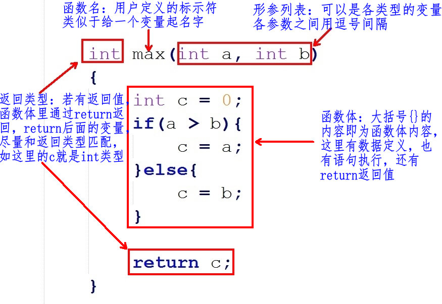
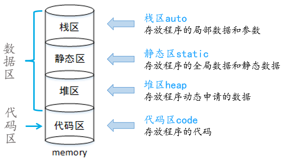

### 函数

函数名：本质上是指函数代码在内存中的首字节地址，是一个地址常量，实际上直接写函数地址的形式，也是可以调用函数的，比如：0x27364748(20,30)

指针作函数参数，具有输入输出特性，加const修饰指针可以防止实参被修改



### 函数的形参和实参

- 形参出现在函数定义中，在整个函数体内都可以使用，离开该函数则不能使用。
- 实参出现在主调函数中，进入被调函数后，实参也不能使用。
- 实参变量对形参变量的数据传递是“值传递”，即单向传递，只由实参传给形参，而不能由形参传回来给实参。
- 在调用函数时，编译系统临时给形参分配存储单元。调用结束后，形参单元被释放。
- 实参单元与形参单元是不同的单元。调用结束后，形参单元被释放，函数调用结束返回主调函数后则不能再使用该形参变量。实参单元仍保留并维持原值。因此，在执行一个被调用函数时，形参的值如果发生改变，并不会改变主调函数中实参的值

### 函数定义和声明的区别

1）定义是指对函数功能的确立，包括指定函数名、函数类型、形参及其类型、函数体等，它是一个完整的、独立的函数单位。
2）声明的作用则是把函数的名字、函数类型以及形参的个数、类型和顺序(注意，不包括函数体)通知编译系统，以便在对包含函数调用的语句进行编译时，据此对其进行对照检查（例如函数名是否正确，实参与形参的类型和个数是否一致）。

### 外部函数

```
extern int add(int x, int y);
```

### 内部函数（静态函数）

```
static void show(int x){
  	print("%d",x);
}
```

### 函数库

静态链接库：.a 归档文件（库文件）

动态链接库：共享库

### 常见的库函数

字符串函数，声明在string.h中

| 函数声明    | 功能描述  |
| ------- | ----- |
| memcpy  |       |
| memmove |       |
| memset  |       |
| memcmp  |       |
| memchr  |       |
| strcpy  | 字符串拷贝 |
| strncpy |       |
| strcmp  | 字符串比较 |
| strncm  |       |
| strdup  |       |
| strndup |       |
| strchr  |       |
| strstr  |       |
| strtok  |       |

man手册


man手册的使用

数学库函数，math.h

| 函数声明           | 功能描述 |
| -------------- | ---- |
| clock()        | 当前时间 |
| system("cls"); | 清空屏幕 |

### 内存四区

开发人员将程序编写完成之后，程序要先装载到计算机的内核或者半导体内存中，再运行程序。


C语言程序运行时，操作系统会为其分配内存空间，这段空间主要分为四个区域，分别为：栈区、堆区、数据区和代码区。统称为“内存四区”。



| 内存四区 | 分配时机                                     | 释放时机                |
| ---- | ---------------------------------------- | ------------------- |
| 静态内存 | 内存分配时分配，在程序运行期间一直存在，由编译器负责分配。            | 程序退出时释放             |
| 栈内存  | 在函数调用的同时创建，函数入栈前回味函数、函数参数、函数中定义的变量在栈中申请空间。 | 函数结束时释放             |
| 堆内存  | 程序员根据需要使用malloc()等函数申请。                  | 在适当时机由程序员使用free()释放 |

- 栈区：栈区是一块连续的内存区域，该区域由编译器自动分配和释放，一般用来存放函数的参数、局部变量以及调用函数和被调用函数的联系等。
  - 空间实现自动管理：自动分配，自动释放
  - 能够被反复使用
  - 脏内存
  - 临时性
- 堆区：动态分配，malloc()，free()

堆可以是不连续的内存区域，此段区域可以由程序开发者自主申请，其使用比较灵活，但缺点是同样需要程序开发人员自主释放，若程序结束时该段空间仍未被释放，就会造成内存泄露，最后由系统回收。

- 数据区：分为静态全局区和常量区两个域
  - 静态全局区：用于存储全局变量和静态变量的区域
  - 常量区：存储字符串常量和其它常量的区域，该区域在程序结束后由操作系统释放。
- 代码区：用于存放函数体的二进制代码

### 堆和栈的区别

堆在操作系统中有一个记录空闲内存地址的链表。当系统收到程序的申请时，系统就会开始遍历该链表，寻找第一个空间大于所申请空间的堆结点，然后将该节点从空闲结点链表中删除，并将该节点的空间分配给程序。另外，对于大多数系统，会在这块内存空间中的首地址处记录本次分配的大小。这样，代码中的删除语句才能正确地释放本内存空间。如果找到的堆节点的大小与申请的大小不相同，系统会自动地将多余的那部分重新放入空闲链表中。

- 申请大小的限制

堆是向高地址扩展的数据结构，是不连续的内存区域。这是由于系统用链表来存储的空闲内存地址，地址是不连续的，而链表的遍历方向是由低地址向高地址。堆的大小受限于计算机系统中有效的虚拟内存，因此堆获得的空间比较灵活，也比较大。

栈是向低地址扩展的数据结构，是一块连续的内存区域。因此，栈顶的地址和栈的最大容量是系统预先规定好的，如果申请的空间超过栈的剩余空间时，将提示栈溢出，因此，能从栈获得的空间较小。

- 堆和栈中的存储内容

堆一般在堆的头部用一个字节存放堆的大小，堆中的具体内容由程序员安排。

在调用函数时，第一个进栈的是函数调用语句的下一条可执行语句的地址，然后是函数的各个参数，在大多数的C语言编译器中，参数是由右往左入栈的，然后是函数中的局部变量。当本次函数调用结束后，局部变量先出栈，然后是参数，最后栈顶指针指向最开始的存储地址，也就是调用该函数处的下一条指令，程序由该点继续运行。

- 申请速度的限制

堆是由malloc等语句分配的内存，一般速度比较慢，而且容易产生内存碎片，不过用起来很方便。栈由系统自动分配，速度较快，但程序员一般无法控制。

#### 内存申请函数

- malloc()
- calloc()
- realloc()

#### 内存回收

使用malloc()函数、calloc()函数、realloc()函数申请到的空间都为堆空间，程序结束之后，系统不会将其自动释放，需要由程序员自主管理。

### 内存泄露

程序结束时，必须保证从堆区申请的所有空间都被安全释放，否则会造成内存泄露。堆上的空间在使用完毕后若未释放，将会一直占据该存储空间，知道程序结束。

### 虚拟地址


### 函数调用模型变量传递分析


### 存储类

就是存储类型，栈，堆，数据段，bss段，text段

auto 修饰局部变量，自动局部变量，分配在栈上，普通的局部变量默认就是auto修饰的

static 修饰局部变量，静态局部变量，分配在data段或bss段，生命周期和全局变量一样，作用域是代码块作用域，链接属性是无链接；

修饰全局变量，静态全局变量

全局变量，作用域是文件作用域，链接属性是外链接

register 寄存器变量，修饰变量时，编译器会尽量分配在寄存器中，提高访问效率

extern 修饰全局变量，实现跨文件访问变量，extern int var;

volatile 编译器在遇到volatile修饰的变量时不会对其进行优化（java中会禁止指令重排）

restrict 用于限定和约束指针，所有希望修改该指针指向的内存时，都必须使用该指针才可以进行，目的是让编译器进行更好的优化

typedef 给类型起别名

### 作用域

描述这个变量起作用的代码范围

代码块作用域

文件作用域

### 生命周期

### 链接属性

预编译，编译，汇编，链接

三种链接属性：

外链接：跨文件访问，extern修饰的全局变量和函数

内链接：static静态修饰全局变量和函数

无链接：局部变量（auto和static的）

### 命名冲突问题 

static修饰，内链接

### Linux的内存映像


内核空间3G~4G，用户空间 0G~3G

text，rodada 只读数据段

data 初始化的数据，bss 未初始化的数据

堆，动态分配的内存，malloc

栈，也叫临时区，存放局部变量，函数参数等

### 函数数据类型

