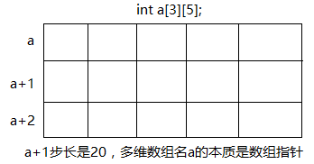

数组名是数组首元素的地址，数组名是常量，不能修改

数组作为函数会退化为指针

指针数组：元素为指针的数组

数组指针：指向数组的指针

多维数组在内存中是线性存储的

多维数组名的本质是数组指针

### 数组的基本概念

整个数组的地址和数组首元素的地址

```c
void main11()
{
	int a[] = {1, 2};
	int b[100] = {1, 3};
	int c[200] = {0}; //编译的时候就已经确定所有的值为零

	memset(c, 0, sizeof(c)); //显式的重置内存块
	//对一维数组 C 规定：
	//c 是数组首元素的地址 c+1 步长 4个字节
	//&c 是整个数组的地址 &c+1 步长 200*4 

	system("pause");
	return ;
}
```

### 数组数据类型

```c
void main12()
{
	typedef int (MyArrayType)[5]; //定义了一个数据类型,数组数据类型
	int i = 0;
	MyArrayType  myArray;  //int myArray[5];

	for (i=0; i<5; i++)
	{
		myArray[i] = i+1;
	}

	for (i=0; i<5; i++)
	{
		printf("%d ", myArray[i]);
	}

	printf("myArray代表数组首元素的地址 myArray:%d myArray+1:%d \n", myArray, myArray+1);
	printf("&myArray代表整个数组的地址 &myArray:%d &myArray+1:%d \n", &myArray, &myArray+1);

	system("pause");
	return ;
}
```

### 数组指针

```c
void main13()
{
	char *Myarray[] = {"1111", "33333", "aaaa"}; //指针数组

	//数组指针:用一个指针来指向一个数组

	typedef int (MyArrayType)[5]; //定义了一个数据类型,数组数据类型
	int i = 0;
	MyArrayType  myArray;  //int myArray[5]; //用类型定义变量 
	MyArrayType *pArray; //定义一个指针变量,这个指针变量 指向一个数组

	{
		int  a;
		int *p = NULL;
		p = &a;

	}
	{
		int myArray2[5]; //相当于一级指针
		pArray = &myArray2; //相当于2级指针
		for (i=0; i<5; i++)
		{
			(*pArray)[i] = i+1;
		}
	
		for (i=0; i<5; i++)
		{
			printf("%d ", (*pArray)[i]);
		}
	}
	
	system("pause");
	return ;
}
```
定义数组指针变量的第二种方法
```c
void main14()
{
	//定义声明一个数组指针类型
	typedef int (*PArrayType)[5];
	PArrayType pArray;  //告诉编译器给我分配一个指针变量

	int c[5];
	int i  = 0;
	pArray = &c;

	for (i=0; i<5; i++)
	{
		(*pArray)[i] = i + 1;
	}

	for (i=0; i<5; i++)
	{
		printf("%d ", (*pArray)[i]);
	}

	system("pause");
	return ;
}
```
定义数组指针变量的第三种方法
```c
//前2种方法 通过类型定义变量 比较麻烦
void main116()
{
	//int [][5]
	int (*pMyArray)[5]; //直接定义一个指向数组的数组指针变量
	int c[5];
	int i  = 0;
	pMyArray = &c;

	for (i=0; i<5; i++)
	{
		(*pMyArray)[i] = i + 1;
	}

	for (i=0; i<5; i++)
	{
		printf("%d ", (*pMyArray)[i]);
	}

	system("pause");
	return ;
}
```
### 多维数组的本质

多维数组名的本质是数组指针

数组首元素的地址和数组地址是两个不同的概念。

数组名代表数组首元素的地址，它是个常量。变量本质是内存空间的别名，一定义数组，就分配内存，内存就固定了。所以数组名起名以后就不能被修改了。

```c
void printArray01(int a[3][5])
{
	int i, j, tmp = 0;
	for (i=0; i<3; i++)
	{
		for (j=0; j<5; j++)
		{
			printf("%d ", a[i][j]);
		}
	}
}

void printArray02(int a[][5])
{
	int i, j, tmp = 0;
	for (i=0; i<3; i++)
	{
		for (j=0; j<5; j++)
		{
			printf("%d ", a[i][j]);
		}
	}
}

void printArray03( int (*b)[5])
{
	int i, j, tmp = 0;
	for (i=0; i<3; i++)
	{
		for (j=0; j<5; j++)
		{
			printf("%d ", b[i][j]);
		}
	}
}

//多维数组做函数参数退化过程
//为什么 
void main222()
{
	int a[3][5], i=0, j=0;
	int tmp = 1;

	for (i=0; i<3; i++)
	{
		for (j=0; j<5; j++)
		{
			a[i][j] = tmp++;
		}
	}

	printf("----------------\n");
	printArray03(a);

	for (i=0; i<3; i++)
	{
		for (j=0; j<5; j++)
		{
			printf("%d ", a[i][j]);
		}
	}

	// a 多维数组名代表？
	printf("a %d , a+1:%d ", a, a+1);  //a+1的步长是20个字节 5*4
	printf("&a %d , &a+1:%d ", &a, &a+1);

	{
		//定义一个指向数组的指针变量 
		int (*pArray)[5] ;//告诉编译器分配4个字节的内存 32bit平台下
		pArray = a;

		printf("\n");
		for (i=0; i<3; i++)
		{
			for (j=0; j<5; j++)
			{
				printf("%d ", pArray[i][j]);
			}
		}
	}

	//多维数组名的本质,数组指针 ，步长:一维的长度

	// (a+i) 代表是整个第i行的地址  二级指针
	// *(a+i) 代表 1级指针  第i行首元素的地址
	// *(a+i) + j  ===> &  a[i][j]

	//*( *(a+i) + j) ===>a[i][j]元素的值

	//a[i][j] <=== >*( *(a+i) + j)
	//a[i] ===> a[0+i] ==> *(a+i);
	//a[i][j] === a[0+i][j]  ==>  *(a+i)[j]  ===>  *(a+i)[0 + j] ==>  *( *(a+i)  + j) 

	system("pause");
	return ;
}
```
### 多维数组在内存中是线性存储的




```c
void printfArray01(int *array, int size)
{
	int  i = 0;
	for (i=0; i<size; i++)
	{
		printf("%d ", array[i]);
	}
}
void main331()
{
	int a[3][5];
	int i, j, tmp = 1;

	for (i=0; i<3; i++)
	{
		for (j=0; j<5; j++)
		{
			a[i][j] = tmp++;
		}
	}

	//把二维数组当成一维数组来打印证明线性存储
	printfArray01((int *)a, 15);

	system("pause");
	return ;
}
```

### 数组作函数参数的退化问题

数组作函数参数，传参传递的只是数组首元素的首字节地址

```c
void fun(int buf[100]){ // 等价于 int buf[] 和 int *buf
  	printf("%d\n", sizeof(buf)); // 4
}

int main(void){
  	int buf[100];
  	printf("%d\n", sizeof(buf)); // 400
  	fun(buf);
  	return 0;
}

void fun(int n, int buf[n]){ // [n]中的n只是起到说明的作用
  	printf("%d\n", sizeof(buf));
}
```

等价关系

| 数组参数                  | 等效的指针参数              |
| --------------------- | -------------------- |
| 一维数组 `char a[30]`     | 指针 `char*`           |
| 指针数组 `char *a[30]`    | 指针的指针 `char **a`     |
| 二维数组 `char a[10][30]` | 数组的指针 `char(*a)[30]` |

### 指针数组的应用场景

```c
//求关键字在表中的位置
//一个入口多个出口
int searcheKeyTable(const char* table[], const int size, const char* key, int *pos)
{
	int rv = 0;
	int i = 0;
	int inum = 0;
	if (table==NULL || key==NULL || pos==NULL)
	{
		rv = -1;
		printf("func searcheKeyTable:%d", rv);
		return rv;
	}

	//间接的证明数组做函数参数的退化
	inum = (sizeof(table)/sizeof(*table)); // inum = 1

	for(i=0; i<size; i++)
	{
		if( strcmp(key, table[i]) == 0 )
		{
			*pos = i;
			//break;
			return rv;	
		}
	}

	//没有找到返回-1
	if (i == size)
	{
		*pos = -1;
	}
	return rv;
}

#define DIM(a) (sizeof(a)/sizeof(*a))

int main411()
{
	int inum = 0;
	int pos = 0;
	int a[10];
	int i = 0;
	//指针数组
	char*   c_keyword[] = {
		"while", 
		"case",
		"static",
		"do"
	};

	searcheKeyTable( c_keyword, DIM(c_keyword),"do", &pos);
	// ===> 带参数的宏
	//searcheKeyTable( c_keyword, (sizeof(c_keyword)/sizeof(*c_keyword)),"do", &pos);
	//searcheKeyTable( c_keyword, inum,"do", &pos);
	printf("pos:%d\n", pos);
	//searcheKeyTable(NULL, DIM(c_keyword),"do", &pos);
	//printf("pos:%d\n", pos);
	searcheKeyTable( c_keyword, DIM(c_keyword), "static", &pos);
	printf("pos:%d\n", pos);

	system("pause");
	return ;
}

```

命令行参数

```c
//main函数是操作系统调用的函数
//在程序执行的时候可以向main函数传递参数

/*
argc 命令行参数
argv 命令行参数数组
env  函数变量数组

int main();
int main(int argc);
int main(int argc, char *argv[])
*/

int main477(int argc, char* argv[], char**env)
{
	int i = 0;
	//main02_1();

	printf("******************* Begin argv *******************\n");
	for(i=0; i<argc; i++)
	{
		printf("%s\n", argv[i]);
	}

	// 	for(i=0; argv[i]!=NULL; i++)
	// 	{
	// 		printf("%s\n", argv[i]);
	// 	}
	printf("******************* End argv *******************\n");

	printf("\n");
	printf("\n");
	printf("\n");

	printf("******************* Begin env *******************\n");

	for(i=0; env[i]!=NULL; i++)
	{
		printf("%s\n", env[i]);
	}

	printf("******************* End env*******************\n");

	getchar();
}
```

指针数组的自我结束能力

```c
void main()
{
	int inum = 0;
	int pos = 0;
	int a[10];
	int i = 0;
	//指针数组的自我结束能力
	char*   c_keyword[] = {
		"while", 
		"case",
		"static",
		"do",
		'\0'
	};  

	char*   c_keyword2[] = {
		"while", 
		"case",
		"static",
		"do",
		0
	}; 


	char*   c_keyword3[] = {
		"while", 
		"case",
		"static",
		"do",
		NULL
	}; 

	for (i=0; c_keyword[i] != NULL; i++)
	{
		printf("%s\n", c_keyword[i]);
	}
	printf("\n....\n");
	for (i=0; c_keyword2[i] != NULL; i++)
	{
		printf("%s\n", c_keyword2[i]);
	}
	printf("\n....\n");
	for (i=0; c_keyword3[i] != NULL; i++)
	{
		printf("%s\n", c_keyword3[i]);
	}

	system("pause");
}
```