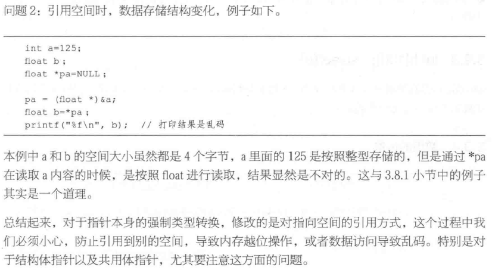

### 指针变量数据类型的强制转换

必须显式强制类型转换，不允许隐式类型转换

- 指向空间的强制类型转换，本质上就是普通变量的强制类型转换

```c
int a = 10;
float b = 3.14;
int *pa = &a;
float *pb = &b;
*pa = (int)*pb; // 等价于 a = (int)b;
```

- 指针本身强制类型转换，改变的是对其指向空间的引用方式（空间大小和存储结构）

```c
int a = 10;
int *pa = &a;
float *pb = NULL;
pb = (float *)pa; // 或者 pb = (float *)&a;
```

将指针pa存放的地址转换为 (float *) 后，赋值给pb。pb里面的地址值与pa里面的地址值是相等的，但是 pa 放的是 (int *) ，而 pb 放的是 (float *) 型。虽然它们指向同一个空间 a ，但不同的是，当使用 *pb 去使用变量空间 a 的时候，会以float型的空间大小和数据存储结构使用a空间的值。

- 指针变量本身强制类型转换需要注意的问题




1.一个指针变量占用多少个字节的内存空间？占用的空间是否会跟随所指向变量的类型而改变？

在同一种编译器环境下，一个指针变量所占用的内存空间是固定的。比如，在16位编译器环境下，任何一个指针变量都只占用2个字节，并不会随所指向变量的类型而改变。

| 数据类型   | 16位编译器 | 32位编译器 | 64位编译器 |
| ------ | ------ | ------ | ------ |
| char   | 1      | 1      | 1      |
| void * | 2      | 4      | 8      |

2.既然每个指针变量所占用的内存空间是一样的，而且存储的都是地址，为何指针变量还要分类型？而且只能指向一种类型的变量？比如指向int类型的指针、指向char类型的指针。

```c
int i = 2;
char c = 1;
char *p = &c;
printf("%d", *p);
```

输出结果是1，如果把第三行代码改成`int *p = &c;`，输出结果是513

原因分析：根据变量的定义顺序，这些变量在内存中大致如下图排布：


其中，指针变量p和int类型变量i各占2个字节，char类型的c占一个字节，p指向c，因此p值就是c的地址

最初的时候，我们用`char *p`指向变量c。当利用 *p 来获取变量c的值时，由于指针p知道变量c是char类型的，所以会从ffc3这个地址开始读取1个字节的数据：0000 0001，转为10进制就是1

后来，我们用`int *p`指向变量c。当利用 *p 获取变量c的值时，由于指针p认为变量c是int类型的，所以会从ffc3这个地址开始读取2个字节的数据：0000 0010 0000 0001，转为10进制就是513