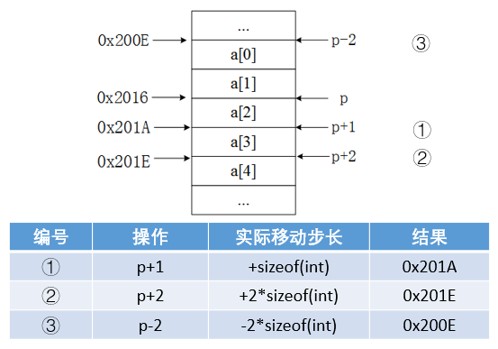
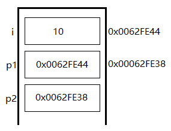
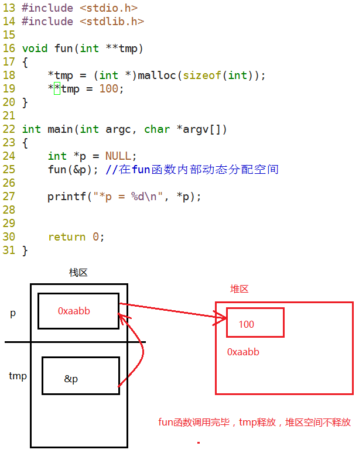
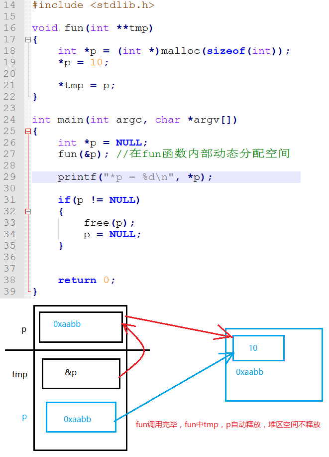

## 1. 内存

内存含义：

存储器：计算机的组成中，用来存储程序和数据，辅助CPU进行运算处理的重要部分。
内存：内部存贮器，暂存程序/数据——掉电丢失 SRAM、DRAM、DDR、DDR2、DDR3。
外存：外部存储器，长时间保存程序 

数据—掉电不丢ROM、ERRROM、FLASH（NAND、NOR）、硬盘、光盘。

内存是沟通cpu与硬盘的桥梁：

- 暂存放CPU中的运算数据 
- 暂存与硬盘等外部存储器交换的数据

## 2. 物理存储器和存储地址空间

有关内存的两个概念：物理存储器和存储地址空间。

物理存储器：实际存在的具体存储器芯片。

主板上装插的内存条
显示卡上的显示RAM芯片 
各种适配卡上的RAM芯片和ROM芯片

存储地址空间：对存储器编码的范围。我们在软件上常说的内存是指这一层含义。 
编码：对每个物理存储单元（一个字节）分配一个号码 
寻址：可以根据分配的号码找到相应的存储单元，完成数据的读写

## 3. 内存地址

将内存抽象成一个很大的一维字符数组。 

编码就是对内存的每一个字节分配一个32位或64位的编号（与32位或者64位处理器相关）。 

这个内存编号我们称之为内存地址。

内存中的每一个数据都会分配相应的地址：

- char:占一个字节分配一个地址 
- int: 占四个字节分配四个地址 
- float、struct、函数、数组等

## 4. 指针和指针变量

一个变量的地址称为该变量的“指针”，如果有一个专门的变量来存放其他变量的地址（指针），这个变量被称为“指针变量”。指针变量是变量，它也占据一块内存空间。

- 内存区的每一个字节都有一个编号，这就是“地址”。 
- 如果在程序中定义了一个变量，在对程序进行编译或运行时，系统就会给这个变量分配内存单元，并确定它的内存地址(编号) 
- 指针的实质就是内存“地址”。指针就是地址，地址就是指针。 
- 指针是内存单元的编号，指针变量是存放地址的变量。 
- 通常我们叙述时会把指针变量简称为指针，实际他们含义并不一样。
- & 取址运算符
- \* 取值运算符
- 数组指针：指向数组的指针
- 指针数组：存储数据类型为指针的数组
- 函数指针：指向函数的指针，指向一个函数的入口地址，可以通过函数指针调用函数
- 指针函数：返回值为指针的函数
- 常量指针：`const  int  *p;`
- 指针常量：指针存放的地址不能改变，`int * const p;`
- 常指针：指针所指向的地址不能被改变，且所指向地址中的值也不能被改变，`const int *` const p;
- 指针是一种变量，指针变量和指针变量所指向的内存空间是不同的概念，在32位系统中指针占4个字节，在64位系统中，指针占8个字节
- 指针指向谁，就把谁的地址赋给指针
- 间接赋值是指针的最大意义所在
- 万能指针（泛型指针）`void *`
- 数组名做函数参数，函数的形参会退化为指针

## 5. 指针基础知识
### 5.1 指针变量的定义和使用

- 指针也是一种数据类型，指针变量也是一种变量。
- 指针变量指向谁，就把谁的地址赋值给指针变量。
- “*”操作符操作的是指针变量指向的内存空间。
- 指针变量和它所指向的内存空间变量是两个不同概念
- 理解指针的关键，是在内存，没有内存哪来的指针

```c
#include <stdio.h>

int main()
{
 int a = 0;
 char b = 100;
 printf("%p, %p\n", &a, &b); //打印a, b的地址

 //int *代表是一种数据类型，int*指针类型，p才是变量名
 //定义了一个指针类型的变量，可以指向一个int类型变量的地址
 int *p;
 p = &a;//将a的地址赋值给变量p，p也是一个变量，值是一个内存地址编号
 printf("%d\n", *p);//p指向了a的地址，*p就是a的值

 char *p1 = &b;
 printf("%c\n", *p1);//*p1指向了b的地址，*p1就是b的值

 return 0;
}
```
注意：&可以取得一个变量在内存中的地址。但是，不能取寄存器变量，因为寄存器变量不在内存里，而在CPU里面，所以是没有地址的。

### 5.2 通过指针间接修改变量的值
```c
 int a = 0;
 int b = 11;
 int *p = &a;

 *p = 100;
 printf("a = %d, *p = %d\n", a, *p);

 p = &b;
 *p = 22;
 printf("b = %d, *p = %d\n", b, *p);
```

### 5.3 指针大小

- 使用sizeof()测量指针的大小，得到的总是：4或8
- sizeof()测的是指针变量指向存储地址的大小 
- 在32位平台，所有的指针（地址）都是32位(4字节) 
- 在64位平台，所有的指针（地址）都是64位(8字节)

```c
 int *p1;
 int **p2;
 char *p3;
 char **p4;
 printf("sizeof(p1) = %d\n", sizeof(p1));
 printf("sizeof(p2) = %d\n", sizeof(p2));
 printf("sizeof(p3) = %d\n", sizeof(p3));
 printf("sizeof(p4) = %d\n", sizeof(p4));
 printf("sizeof(double *) = %d\n", sizeof(double *));
```
### 5.4 野指针和空指针

指针变量也是变量，是变量就可以任意赋值，不要越界即可（32位为4字节，64位为8字节），但是，任意数值赋值给指针变量没有意义，因为这样的指针就成了野指针，此指针指向的区域是未知(操作系统不允许操作此指针指向的内存区域)。所以，野指针不会直接引发错误，操作野指针指向的内存区域才会出问题。
```c
 int a = 100;
 int *p;
 p = a; //把a的值赋值给指针变量p，p为野指针， ok，不会有问题，但没有意义

 p = 0x12345678; //给指针变量p赋值，p为野指针， ok，不会有问题，但没有意义

 *p = 1000;  //操作野指针指向未知区域，内存出问题，err
```
但是，野指针和有效指针变量保存的都是数值，为了标志此指针变量没有指向任何变量(空闲可用)，C语言中，可以把NULL赋值给此指针，这样就标志此指针为空指针，没有任何指针。

```c
int *p = NULL;
```

NULL是一个值为0的宏常量：
```c
#define NULL    ((void *)0)
```
### 5.5 强制类型转换

#### 1) 类型转换

`int *`可以指向int地址，`char *`可以指向char地址，但指针变量之间的赋值类型检查比较严格，不同类型的指针变量相互转换编译器会有警告。

但是，由于指针变量在同一系统下的大小是一样的，而且指针变量保存的是变量首地址，不同类型的指针变量通过强制类型转换进行相互赋值。

```c
 int a = 0x1234, b = 0x5678;
 char *p1, *p2;
 printf("%0x %0x\n", a, b);

 p1 = (char *)&a;
 p2 = (char *)&b;
 printf("%0x %0x\n", *p1, *p2);
```
#### 2) 万能指针

`void *`指针可以指向任意变量的内存空间
```c
 void *p = NULL;

 int a = 10;
 p = (void *)&a; //指向变量时，最好转换为void *

 //使用指针变量指向的内存时，转换为int *
 *( (int *)p ) = 11;
 printf("a = %d\n", a);
```

### 5.6 const修饰的指针变量

```c
 int a = 100;
 int b = 200;

//指向常量的指针
 //修饰*，指针指向内存区域不能修改，指针指向可以变
 const int *p1 = &a; //等价于int const *p1 = &a;
 //*p1 = 111; //err
 p1 = &b; //ok

//指针常量
 //修饰p1，指针指向不能变，指针指向的内存可以修改
 int * const p2 = &a;
 //p2 = &b; //err
 *p2 = 222; //ok
```
## 6. 指针和数组

### 6.1 数组名

数组名字是数组的首元素地址，但它是一个常量：

```c
 int a[] = { 1, 2, 3, 4, 5, 6, 7, 8, 9 };
 printf("a = %p\n", a);
 printf("&a[0] = %p\n", &a[0]);

 //a = 10; //err, 数组名只是常量，不能修改
```

### 6.2 指针法操作数组元素

```c
#include <stdio.h>

int  main()
{
 int a[] = { 1, 2, 3, 4, 5, 6, 7, 8, 9 };
 int i = 0;
 int n = sizeof(a) / sizeof(a[0]);
 for (i = 0; i < n; i++)
 {
  //printf("%d, ", a[i]);
  printf("%d, ", *(a+i));
 }
 printf("\n");

 int *p = a; //定义一个指针变量保存a的地址
 for (i = 0; i < n; i++)
 {
  p[i] = 2 * i;
 }

 for (i = 0; i < n; i++)
 {
  printf("%d, ", *(p + i));
 }
 printf("\n");

 return 0;
}
```

### 6.3 指针加减运算

#### 加法运算

- 指针计算不是简单的整数相加
- 如果是一个int *，+1的结果是增加一个int的大小
- 如果是一个char *，+1的结果是增加一个char大小

以int型指针为例，假设int*型指针p中存储的地址为0x2016，对其进行如下操作：



```c
#include <stdio.h>

int main()
{
 int a;
 int *p = &a;
 printf("%d\n", p);
 p += 2;//移动了2个int
 printf("%d\n", p);

 char b = 0;
 char *p1 = &b;
 printf("%d\n", p1);
 p1 += 2;//移动了2个char
 printf("%d\n", p1);

 return 0;
}
```
通过改变指针指向操作数组元素：

```c
#include <stdio.h>

int main()
{
 int a[] = { 1, 2, 3, 4, 5, 6, 7, 8, 9 };
 int i = 0;
 int n = sizeof(a) / sizeof(a[0]);

 int *p = a;
 for (i = 0; i < n; i++)
 {
  printf("%d, ", *p);
  p++;
 }
 printf("\n");
 return 0;
}
```
#### 减法运算

示例1：

```c
#include <stdio.h>

int main()
{
 int a[] = { 1, 2, 3, 4, 5, 6, 7, 8, 9 };
 int i = 0;
 int n = sizeof(a) / sizeof(a[0]);

 int *p = a+n-1;
 for (i = 0; i < n; i++)
 {
  printf("%d, ", *p);
  p--;
 }
 printf("\n");

 return 0;
}
```
示例2：

```c
#include <stdio.h>

int main()
{
 int a[] = { 1, 2, 3, 4, 5, 6, 7, 8, 9 };
 int *p2 = &a[2]; //第2个元素地址
 int *p1 = &a[1]; //第1个元素地址
 printf("p1 = %p, p2 = %p\n", p1, p2);

 int n1 = p2 - p1; //n1 = 1
 int n2 = (int)p2 - (int)p1; //n2 = 4
 printf("n1 = %d, n2 = %d\n", n1, n2);
 return 0;
}
```
#### 指针的步长

p+1 = p的值+p的基类型的字节数，p+1 = p + 1*sizeof(p的数据类型)


### 6.4 指针数组

指针数组，它是数组，数组的每个元素都是指针类型。

```c
#include <stdio.h>

int main()
{
 //指针数组
 int *p[3];
 int a = 1;
 int b = 2;
 int c = 3;
 int i = 0;

 p[0] = &a;
 p[1] = &b;
 p[2] = &c;

 for (i = 0; i < sizeof(p) / sizeof(p[0]); i++ )
 {
  printf("%d, ", *(p[i]));
 }
 printf("\n");
 return 0;
}
```
## 7. 多级指针 

- C语言允许有多级指针存在，在实际的程序中一级指针最常用，其次是二级指针。 
- 二级指针就是指向一个一级指针变量地址的指针。 

```c
 int a = 10;
 int *p = &a; //一级指针
 *p = 100; //*p就是a

 int **q = &p;
 //*q就是p
 //**q就是a

 int ***t = &q;
 //*t就是q
 //**t就是p
 //***t就是a
```

二级指针，分清楚指针变量的值和指针变量的地址

```c
#include<stdio.h>

int main(){
	
	int i = 10;
	int *p1 = &i;
	int **p2 = &p1;
	
	printf("i = %d, &i = %p\n", i, &i);
	printf("*p1 = %d, p1 = %p, &p1 = %p\n", *p1, p1, &p1);
	printf("**p2 = %d, *p2 = %p, p2 = %p\n", **p2, *p2, p2);

	return 0;
}
```

```
i = 10, &i = 0062FE44
*p1 = 10, p1 = 0062FE44, &p1 = 00062FE38
**p2 = 10, *p2 = 0062FE44, p2 = 0062FE38
```



### 二级指针作函数参数





## 8. 指针强化训练

在C语言中，所有的数据类型其实本质都是char的数组。

### int*指向char类型

```c
#include <stdio.h>

int main()
{
 char a[4] = { 1, 2, 3, 4 };
 char *p = a;
 printf("%d, %d, %d, %d\n", *p, *(p + 1), *(p + 2), *(p + 3));

 int *p1 = (int *)a;//把a的地址强转为int *类型
 printf("%d\n", *p1);
 printf("%x\n", *p1);

 return 0;
}
```
### 大端小端验证

```c
#include <stdio.h>

int main()
{
 int a = 0x11223344;
 unsigned char *p = (unsigned char *)&a;

 int i;
 for (i = 0; i < 4; i++)
 {
  printf("%x\n", p[i]);
 }

 return 0;
}
```
### 整型变量转ip地址

```c
#include <stdio.h>

int main()
{
 int ip = 2130706433;
 unsigned char *p = (unsigned char *)&ip;
 printf("%u.%u.%u.%u\n", p[3], p[2], p[1], p[0]);

 return 0;
}
```

### ip地址转整型变量

```c
#include <stdio.h>

int main()
{
 char str[] = "127.0.0.1";
 int a, b, c, d;
 sscanf(str, "%d.%d.%d.%d", &a, &b, &c, &d);
 //printf("%d, %d, %d, %d\n", a, b, c, d);
 unsigned int ip = 0;
 unsigned char *p = (unsigned char *)&ip;
 //把p 当做一个char[4]来看待
 p[0] = d;
 p[1] = c;
 p[2] = b;
 p[3] = a;

 printf("%u\n", ip);

 return 0;
}
```

## 9. 指针和函数

###  函数形参改变实参的值

```c
#include <stdio.h>

void swap1(int x, int y)
{
 int tmp;
 tmp = x;
 x = y;
 y = tmp;
 printf("x = %d, y = %d\n", x, y);
}

void swap2(int *x, int *y)
{
 int tmp;
 tmp = *x;
 *x = *y;
 *y = tmp;
}

int main()
{
 int a = 3;
 int b = 5;
 swap1(a, b); //值传递
 printf("a = %d, b = %d\n", a, b);

 a = 3;
 b = 5;
 swap2(&a, &b); //地址传递
 printf("a2 = %d, b2 = %d\n", a, b);

 return 0;
}
```
### 数组名做函数参数

数组名做函数参数，函数的形参会退化为指针：

```c
#include <stdio.h>

//void printArrary(int a[10], int n)
//void printArrary(int a[], int n)
void printArrary(int *a, int n)
{
 int i = 0;
 for (i = 0; i < n; i++)
 {
  printf("%d, ", a[i]);
 }
 printf("\n");
}

int main()
{
 int a[] = { 1, 2, 3, 4, 5, 6, 7, 8, 9 };
 int n = sizeof(a) / sizeof(a[0]);

 //数组名做函数参数
 printArrary(a, n);

 return 0;
}
```
### 指针做为函数的返回值

```c
#include <stdio.h>

int a = 10;

int *getA()
{
 return &a;
}

int main()
{
 *( getA() ) = 111;
 printf("a = %d\n", a);

 return 0;
}
```
## 10. 内存操作函数

### memset()

```c
#include <string.h>
void *memset(void *s, int c, size_t n);
```
功能：将s的内存区域的前n个字节以参数c填入

参数：

- s：需要操作内存s的首地址
- c：填充的字符，c虽然参数为int，但必须是unsigned char , 范围为0~255
- n：指定需要设置的大小

返回值：s的首地址

```c
 int a[10];

 memset(a, 0, sizeof(a));
 memset(a, 97, sizeof(a));
 int i = 0;
 for (i = 0; i < 10; i++)
 {
  printf("%c\n", a[i]);
 }
```
### memcpy()

```c
#include <string.h>
void *memcpy(void *dest, const void *src, size_t n);
```

功能：拷贝src所指的内存内容的前n个字节到dest所值的内存地址上。

参数：

- dest：目的内存首地址
- src：源内存首地址，注意：dest和src所指的内存空间不可重叠
- n：需要拷贝的字节数

返回值：dest的首地址

```c
 int a[10] = { 1, 2, 3, 4, 5, 6, 7, 8, 9, 10 };
 int b[10];
 memcpy(b, a, sizeof(a));
 int i = 0;
 for (i = 0; i < 10; i++)
 {
  printf("%d, ", b[i]);
 }
 printf("\n");

 //memcpy(&a[3], a, 5 * sizeof(int)); //err, 内存重叠
```
### memcmp()

```c
#include <string.h>
int memcmp(const void *s1, const void *s2, size_t n);
```
功能：比较s1和s2所指向内存区域的前n个字节

参数：

- s1：内存首地址1
- s2：内存首地址2
- n：需比较的前n个字节

返回值：

- 相等：=0
- 大于：>0
- 小于：<0

```c
 int a[10] = { 1, 2, 3, 4, 5, 6, 7, 8, 9, 10 };
 int b[10] = { 1, 2, 3, 4, 5, 6, 7, 8, 9, 10 };

 int flag = memcmp(a, b, sizeof(a));
 printf("flag = %d\n", flag);
```
## 11. 指针和字符串

### 字符指针

```c
#include <stdio.h>

int main()
{
 char str[] = "hello world";
 char *p = str;
 *p = 'm';
 p++;
 *p = 'i';
 printf("%s\n", str);

 p = "mike jiang";
 printf("%s\n", p);

 char *q = "test";
 printf("%s\n", q);

 return 0;
}
```
### 字符指针做函数参数

```c
#include <stdio.h>

void mystrcat(char *dest, const char *src)
{
 int len1 = 0;
 int len2 = 0;
 while (dest[len1])
 {
  len1++;
 }
 while (src[len2])
 {
  len2++;
 }

 int i;
 for (i = 0; i < len2; i++)
 {
  dest[len1 + i] = src[i];
 }
}

int main()
{
 char dst[100] = "hello mike";
 char src[] = "123456";
 mystrcat(dst, src);
 printf("dst = %s\n", dst);

 return 0;
}
```
### 指针数组做为main函数的形参

```c
int main(int argc, char *argv[]);
```
- main函数是操作系统调用的，第一个参数标明argv数组的成员数量，argv数组的每个成员都是`char *类型`
- argv是命令行参数的字符串数组
- argc代表命令行参数的数量，程序名字本身算一个参数

```c
#include <stdio.h>

//argc: 传参数的个数（包含可执行程序）
//argv：指针数组，指向输入的参数
int main(int argc, char *argv[])
{

 //指针数组，它是数组，每个元素都是指针
 char *a[] = { "aaaaaaa", "bbbbbbbbbb", "ccccccc" };
 int i = 0;

 printf("argc = %d\n", argc);
 for (i = 0; i < argc; i++)
 {
  printf("%s\n", argv[i]);
 }
 return 0;
}
```
## 12. 指针小结

| 定义          | 说明                        |
| ----------- | ------------------------- |
| int  i      | 定义整形变量                    |
| int *p      | 定义一个指向int的指针变量            |
| int a[10]   | 定义一个有10个元素的数组，每个元素类型为int  |
| int *p[10]  | 定义一个有10个元素的数组，每个元素类型为int* |
| int func()  | 定义一个函数，返回值为int型           |
| int *func() | 定义一个函数，返回值为int *型         |
| int **p     | 定义一个指向int的指针的指针，二级指针      |

## 13. C 语言的指针

指针是C 语言的难点，也是精华所在！
指针是一个特殊的变量，它里面存储的数值被解释成为内存里的一个地址。
要搞清一个指针需要搞清指针的四方面的内容：指针的类型、指针所指向的类型、指针的值或者叫指
针所指向的内存区、指针本身所占据的内存区。

- 指针的类型：把指针声明语句里的指针名字去掉，剩下的部分就是这个指针的类型，比如int\* p;语句中int\* 就是指针的类型。
- 指针所指向的类型：把指针声明语句中的指针名字和名字左边的指针声明符\*去掉，剩下的就是\*指针所指向的类型（在指针的算术运算中，指针所指向的类型有很大的作用）比如int\* p;语句中，int 就是指针指向的类型。
- 指针所指向的内存区：从指针的值所代表的那个内存地址开始，长度为sizeof(指针所指向的类型)的一片内存区。（一个指针指向了某块内存区域，就相当于说该指针的值是这块内存区域的首地址）
- 指针本身所占据的内存区：用函数sizeof(指针的类型)可以测出指针本身所占据的内存区（在32位平台里，指针本身占据了4 个字节的长度）

## 14. 认识多种指针

- int \*p; （普通指针）

首先从p 处开始,先与\*结合,所以说明p 是一个指针,然后再与int 结合,说明指针所指向的内容的类型为int 型。所以p 是一个返回整型数据的指针。

- int p[3]; （数组不是指针）

首先从P 处开始,先与[]结合,说明p 是一个数组,然后与int 结合,说明数组里的元素是整型的,所以p 是一个由整型数据组成的数组。

- int \*p[3];（多个指针组成的数组） 

首先从P 处开始,先与[]结合,因为其优先级比\*高,所以P 是一个数组,然后再与\*结合,说明数组里的元素是指针类型,然后再与int 结合,说明指针所指向的内容的类型是整型的,所以是一个由返回整型数据的指针所组成的数组

- int (\*p)[3]; （指向数组的指针）

首先从p 处开始,先与\*结合,说明p 是一个指针然后再与[]结合(与"()"这步可以忽略,只是为了改变优先级),说明指针所指向的内容是一个数组,然后再与int 结合,说明数组里的元素是整型的。所以p 是一个指向由整型数据组成的数组的指针

- int \*\*p; （二级指针，指向指针的指针） 

首先从p 开始,先与\*结合,说明p 是一个指针,然后再与\*结合,说明指针所指向的元素是指针,然后再与int 结合,说明该指针所指向的元素是整型数据。所以p 是一个返回指向整型数据的指针的指针。

- int p(int); （返回值为int 的函数，不是指针）

从p 处起,先与()结合,说明p 是一个函数,然后进入()里分析,说明该函数有一个整型变量的参数然后再与外面的int 结合,说明函数的返回值是一个整型数据。所以p 是一个有整型参数且返回类型为整型的函数

- int (\*p)(int);（指向函数的指针）

从p 处开始,先与指针结合,说明p 是一个指针,然后与()结合,说明指针指向的是一个函数,然后再与()里的int 结合,说明函数有一个int 型的参数,再与最外层的int 结合,说明函数的返回类型是整型,所以p 是一个指向有一个整型参数且返回类型为整型的函数的指针

- int \*(\*p(int))[3]; （大脑分析不出来了，有点儿变态了,看说明吧） 

从p 开始,先与()结合,说明p是一个函数,然后进入()里面,与int 结合,说明函数有一个整型变量参数,然后再与外面的\*结合,说明函数返回的是一个指针,然后到最外面一层,先与[]结合,说明返回的指针指向的是一个数组,然后再与\*结合,说明数组里的元素是指针,然后再与int 结合,说明指针指向的内容是整型数据。所以p 是一个参数为一个整数且返回一个指向由整型指针变量组成的数组的指针变量的函数

## 15. 函数指针

函数指针是指向函数的指针变量。因而“函数指针”本身首先应是指针变量，只不过该指针变量指向函数。这正如用指针变量可指向整型变量、字符型、数组一样，这里是指向函数。如前所述，C 在编译时，每一个函数都有一个入口地址，该入口地址就是函数指针所指向的地址。有了指向函数的指针变量后，可用该指针变量调用函数，就如同用指针变量可引用其他类型变量一样，在这些概念上是大体一致的。函数指针有两个用途：调用函数和做函数的参数。