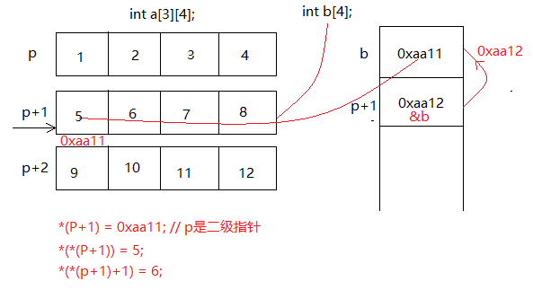

### 数组与指针

数组指针是指向数组的指针，数组中存储的是统一的其他数据类型的变量；指针指向这一块内存的首地址。可以通过指针的移动来依次访问数组中的元素。

指针数组是指数组中存储的是指针，数组中指针的数据类型必须一致，指针数组的定义方式与普通数组类似，只需在类型前面加上“\*”，如`int *arr[10];` 存储了10 个int 类型的指针。

```c
int buf[10] = {0}; 
```

- buf：数组名，表示数组首元素的地址（&buf[0]），是一个常量，不可变（为了保证释放内存的安全性）。
- buf[0]：数组的首元素
- &buf[0]：数组首元素的地址，等价于buf
- &buf：表示数组首地址（整个数组的地址），是一个地址常量，只能作为右值
- buf+1 步长是4字节，&buf+1 步长是4*10字节



### 指针数组

一个元素数据类型为指针的数组

```c
int *p[5];
```

### 带参数的main()函数

```c
int main(int argc, char *argv[]);
```

- argc 表示在命令行中输入的参数个数
- argv 参数是字符串指针数组，其各元素值为命令行中各字符串的首地址

例如：`main.exe arg1 arg2 arg3` ，argc为4，argv指针数组中元素指向的字符串分别是：“main.exe”、 “arg1”、“arg2 ”、“arg3”

### 分析数组指针与指针数组的表达式

```c
int (*p)[10]; // 数组指针
int *p[10]; // 指针数组
```

规律：第一步找核心，第二步找结合（根据运算符优先级）

如果核心和星号\*结合，表示核心是指针；如果核心和中括号[]结合，表示核心是数组；如果核心和小括号()结合，表示核心是函数

### 数组指针作为函数参数

将数组作为函数参数的本质就是将指向数组首元素的指针作为函数参数。数组指针作为函数参数时，由于无法获取数组的长度，所以根据需求传入数组的长度。