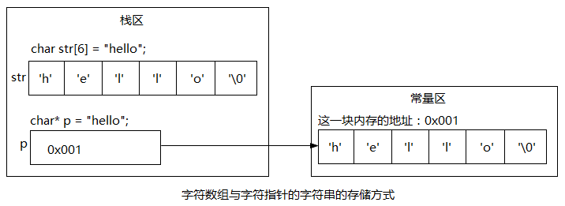
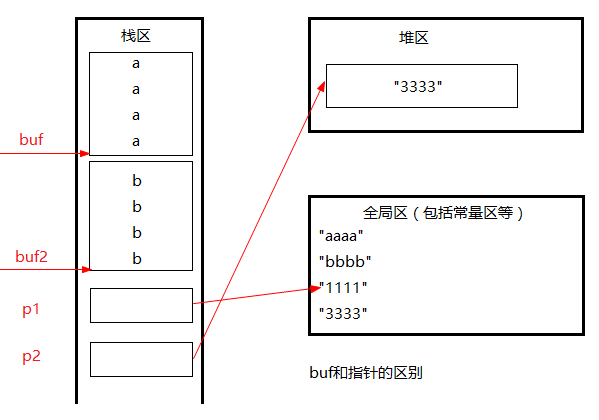
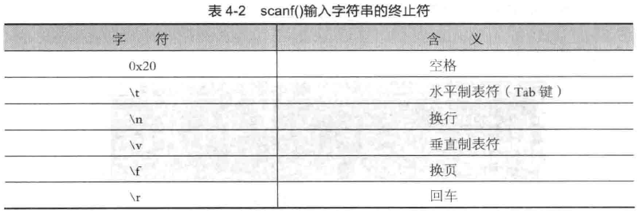

### strlen()函数与sizeof()运算符在求字符串长度时是有所不同的

- sizeof()是运算符；strlen()是C语言标准库函数，包含在string.h头文件中；
- sizeof()运算符功能是获得所建立的对象的字节大小，计算的是类型所占内存的多少；strlen()函数是获得字符串所占内存的有效字节数；
- sizeof()运算符的参数可以是数组、指针、类型、对象和函数等；strlen()函数的参数必须是字符型指针，即它的参数必须以字符串为目标，且必须是以'\0'结尾；
- sizeof()运算符计算大小在编绎就完成，因此不能用来计算动态分配内存的大小；strlen()函数结果要在运行时才能计算出来；

### 转义字符及其作用


### 字符数组

```c
char c[] = {'h','e','l','l','o'};
```

### 字符串

```c
char char_aray[] = {"hello"};
char char_aray[6] = {'h','e','l','l','o','\0'};
```

### 获取字符串长度

```c
sizeof("abc");
strlen("abc");
```

### 字符串与指针

字符串由若干个字符组成，字符型变量作为C语言中一种基础的变量类型，与其它变量一样，都会占用存储空间。我们已经知道指针的本质就是地址，既然字符串中的字符占用存储空间，那么显然它也可以通过指针进行操作。

在C语言中，字符串一般存放在字符数组中。对字符串进行操作有两种方式：

（1）使用数组名加下标的方式获取字符串中的某个字符；使用数组名与格式控制符“%s”输出整个字符串。具体示例如下：

```c
char s[]="this is a string.";
printf("%c\n",s[3]);		
printf("%s\n",s);		
```
（2）声明一个字符型的指针，使该指针指向一个字符串常量，通过该指针引用字符串常量。具体示例如下：
```c
char* s="hello world!";
printf("%c\n",s[3]);
printf("%c\n",*(s+1));
printf("%s\n",s);
```

在将指针指向字符串常量时，指针接收的是字符串中第一个字符的地址，而非整个字符串变量。

虽然字符型的指针和字符数组名都能表示一个字符串，但是它们之间存在细微的差别：字符串的末尾会有一个隐式的结束标志‘\0‘，而数组中不会存储这个结束标志，只会显式地存储字符串中的可见字符。

### 字符数组与字符指针

```c
char str[6] = "hello"; // 字符数组自带内存空间，可以直接用来存放字符数据
char* p = "hello";
```



字符串常量存放在数据区中的字符串常量区，不可以修改

```c
char *getStr()
{
	char *tmp = NULL;
	tmp = "abcdefgf";
	return tmp;
}
void main()
{
	char *p = getStr();
	printf("p:%s \n", p);
	*(p+2) = 'r';  //经常出现的错误 保证指针所指向的内存空间 可以被修改
	system("pause");
	return ;
}
```

字符串1级指针的内存模型图

```c
void main61()
{
	char buf[20]= "aaaa"; //定义并且初始化
	char buf2[] = "bbbb";
	char *p1 = "111111";
	char *p2 = malloc(100);
	strcpy(p2, "3333");

	system("pause");
	return ;
}
```



### 字符串的输入输出

| 函数声明      | 功能描述                        |
| --------- | --------------------------- |
| gets()    | 从标准输入设备读入用户输入的字符串           |
| puts()    | 标准设备输出s字符串，在输出完成后自动输出一个'\n' |
| printf()  | 格式化输出一个字符串                  |
| putchar() | 输出一个字符                      |
| scanf()   | 通过%转义的方式可以得到用户通过标准输入设备输入的数据 |
| getchar() | 从标准输入设备读取一个字符               |
| sprintf() | 将一个整数转为一个字符串                |
| atoi()    | 将字符串转换为整数                   |
| itoa()    | 将整数转换为字符串                   |
| atof()    | 把一个小数形式的字符串转化为一个浮点数         |
| atol()    | 将一个字符串转化为long类型             |

### 常用printf()格式字符


| 格式字符 | 含义                     |
| ---- | ---------------------- |
| %p   | 是以地址形式输出（也就是16进制）      |
| %lu  | 输出unsigned long类型      |
| %llu | 输出unsigned long long类型 |

### 常用scanf()输入字符串的终止符



### 字符串作函数参数

字符串copy函数技术推演

```c
void main71()
{
	char a[] = "i am a student";
	char b[64];
	int  i = 0;

	for (i=0; *(a+i) != '\0'; i++)
	{
		*(b+i) = *(a+i);
	}

	//0没有copy到b的buf中.

	b[i] = '\0'; //重要
	printf("a:%s \n", a);
	printf("b:%s \n", b);

	system("pause");
	return ;
}

//字符串copy函数技术推演
//字符串copy函数

//form形参 形参to 的值 不停的在变化....
//不断的修改了from和to的指向
void copy_str21(char *from, char *to)
{
	for (; *from!='\0'; from++, to++)
	{
		 *to = *from;
	}
	*to = '\0';
	return ;
}

//*操作 和++的操作
//++ 优先级高
void copy_str22(char *from, char *to)
{
	for (; *from!='\0';)
	{
		*to++ = *from++;  //  先 *to = *from;  再from++, to++
	}
	*to = '\0';
	return ;
}

void copy_str23(char *from, char *to)
{
	while( (*to = *from) != '\0' )
	{
		from ++;
		to ++;
	}
}

void copy_str24(char *from , char *to)
{
	while ( (*to++ = *from++) != '\0')
	{
		;
	}
}

void copy_str25(char *from , char *to)
{
	//*(0) = 'a';
	while ( (*to++ = *from++) )
	{
		;
	}
}

void copy_str25_err(char *from , char *to)
{
	//*(0) = 'a';
	while ( (*to++ = *from++) )
	{
		;
	}
	printf("from:%s \n", from);
}

//不要轻易改变形参的值, 要引入一个辅助的指针变量. 把形参给接过来.....
int copy_str26_good(char *from , char *to)
{
	//*(0) = 'a';
	char *tmpfrom = from;
	char *tmpto = to;
	if ( from == NULL || to == NULL)
	{
		return -1;
	}

	while ( *tmpto++ = *tmpfrom++ ) ;  //空语句
	printf("from:%s \n", from);
}

int main111()
{
	int ret = 0;
	char *from = "abcd";
	char buf2[100];
	//copy_str21(from, buf2);
	//copy_str22(from,buf2);
	//copy_str23(from, buf2);
	//copy_str24(from, buf2);
	//copy_str25(from ,buf2);
	//printf("buf2:%s \n", buf2);

	{
		//错误案例
		char *myto = NULL;  //要分配内存
		//copy_str25(from,myto );
	}
	{
		char *myto = NULL;  //要分配内存

		ret = copy_str26_good(from, myto);
		if (ret != 0)
		{
			printf("func copy_str26_good() err:%d  ", ret);
			return ret;
		}
	}
	system("pause");
	return ret;
}

int main777()
{
	int ret = 0;
	char *from = "abcd";
	char buf2[100];

	printf("copy_str25_err begin\n");
	copy_str25_err(from, buf2);
	copy_str26_good(from, buf2);
	printf("copy_str25_err end\n");
	return 0;
}
```

### 项目开发字符串模型strstr_while

求字符串中子串出现的次数

```c
void main81()
{
	//strstr(str, str2)
	int ncount = 0;

	//初始化 让p指针达到查找的条件
	char *p = "11abcd111122abcd3333322abcd3333322qqq";  

	do
	{
		p = strstr(p, "abcd");
		if (p != NULL)
		{
			ncount++;
			p = p + strlen("abcd"); //指针达到下次查找的条件
		}
		else
		{
			break;
		}
	} while (*p != '\0');


	printf("ncount:%d \n", ncount);
	system("pause");
	return ;
}

void main88()
{
	int ncount = 0;

	//初始化 让p指针达到查找的条件
	char *p = "2abcd3333322qqqabcd";  
	while ( p = strstr(p, "abcd"))
	{
		ncount ++;
		p = p + strlen("abcd"); //让p指针达到查找的条件
		if (*p == '\0')
		{
			break;
		}
	}
	printf("ncount:%d \n", ncount);

	printf("hello...\n");
	system("pause");
}

int getCount(char *mystr /*in*/, char *sub /*in*/,int *ncount)
{
	int ret = 0;
	int tmpCount = 0;
	//初始化 让p指针达到查找的条件
	char *p = mystr; //不要轻易改变形参的值

	if (mystr==NULL || sub==NULL ||ncount==NULL)
	{
		ret = -1;
		printf("func getCount() err:%d (mystr==NULL || sub==NULL ||ncount==NULL) \n", ret);
		return ret;
	}

	do
	{
		p = strstr(p, sub);
		if (p != NULL)
		{
			tmpCount++;
			p = p + strlen(sub); //指针达到下次查找的条件
		}
		else
		{
			break;
		}
	} while (*p != '\0');

	*ncount = tmpCount; //间接赋值是指针存在的最大意义
	return ret;
}

int main()
{
	int ret = 0;
	char *p = "abcd111122abcd3333322abcd3333322qqq";
	int count = 0;
	char sub[] = "abcd";

	ret = getCount(p,sub,  &count);
	if (ret != 0)
	{
		printf("func getCount() err:%d \n", ret);
		return ret;
	}

	ret = getCount(p,NULL,  &count);
	if (ret != 0)
	{
		printf("func getCount() err:%d \n", ret);
		return ret;
	}
	printf("count:%d \n", count);
	system("pause");
}
```
