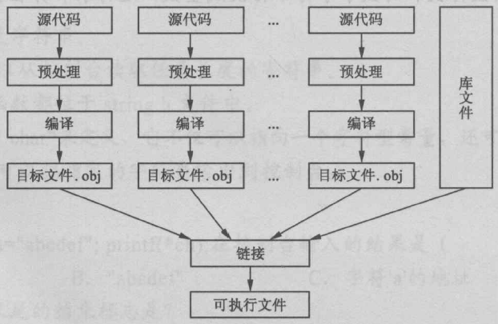
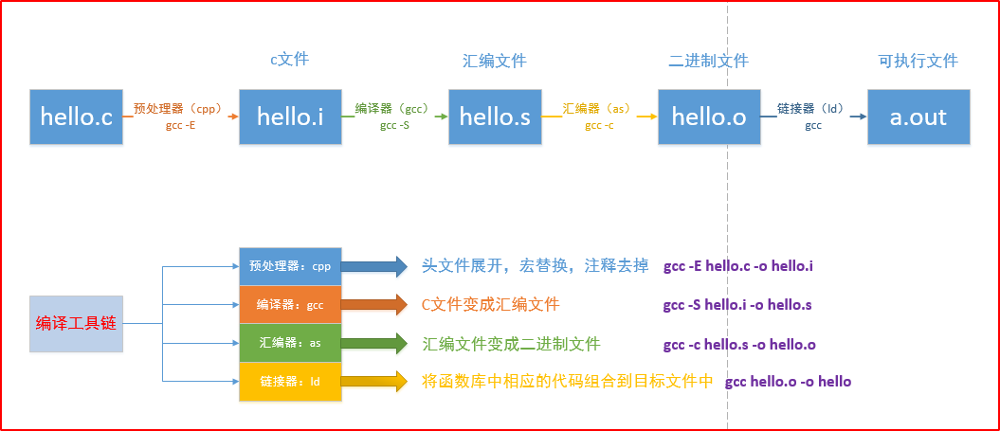
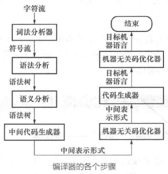

### C语言的运行机制

源代码 --> 预处理 --> 编译 --> 汇编 --> 链接





预处理：宏替换，文件包含，条件编译

编译：词法分析，语法分析，将高级语言指令转换为功能等效的汇编代码

链接：将编译后零散的二进制代码文件组合成二进制可执行文件

### 编译器



### 预处理命令 —— 宏定义

- 字符串替换
- 无参宏定义
- 带参宏定义
- 宏定义允许嵌套
- \#define
- \#undef
- 宏定义中括号的使用是为了防止有关优先级的问题，若参数未加括号，很容易出错

```c
#define PI 3.14
#undef // 取消宏定义，#undef后面的宏都不存在了
#define COMP_CIR(x) 2*PI*x
```

### 预定义宏

- `__DATE__` 日期
- `__FILE__` 文件名
- `__LINE__` 行号
- `__TIME__` 编译时间
- `__FUNCTION__` 函数名

### 文件包含

```c
#include <iostream>
#include "stdio"
#pragma once // 防止头文件被重复包含
#ifndef __CAL_H__ // 防止头文件被重复包含
#define __CAL_H__
#endif
```

`# include<>`  和 `#include ""` 区别

尖括号<>专门用来包含系统提供的头文件

双引号""包含的头文件，编译器默认会先在当前目录下寻找相应的头文件，如果没有找到然后再去系统指定的目录去寻找，如果仍未找到则提示文件不存在

### 条件编译

- `#if #else #endif`
- `#ifdef`
- `#ifndef`

```c
// #if #else #endif
#define SYSTEM Win32
#define DEBUG
void main(){
  	#if SYSTEM == Win32
  		printf("win32\n");
  	#else
  		printf(x64\n);
  	#endif
}

// #ifdef
void main(){
  	int i = 0;
  #ifdef DEBUG
  	printf("i = %d\n", i);
  #endif
  	int j = 3;
  #ifdef DEBUG
  	printf("j = %d\n", j);
}

// #ifndef
#ifndef __FOO_H_
#define __FOO_H_
struct Foo{
  	int i;
};
#endif
```
### 程序调试

- 设置断点
- 单步调试
  - 逐语句（F11，进入方法的内部）
  - 逐过程（F10，不进入方法的内部）
- 观察变量
- 条件断点
- 项目调试